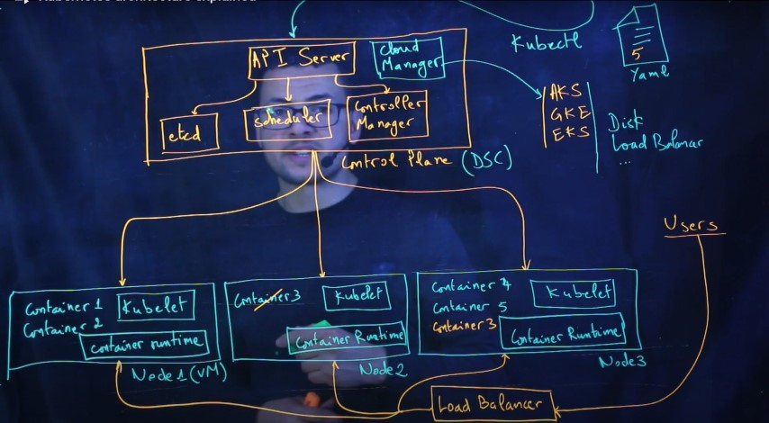
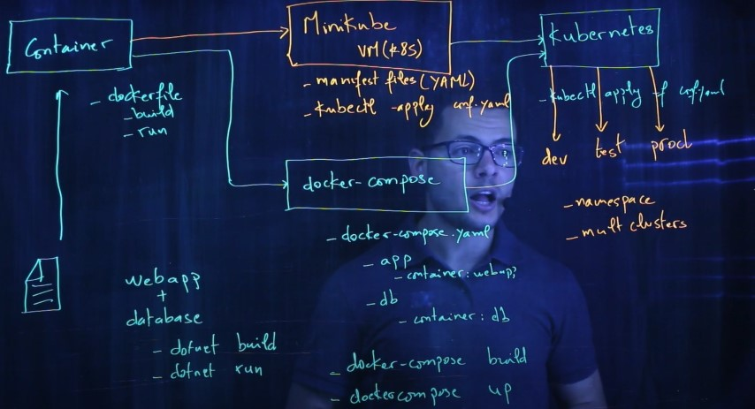
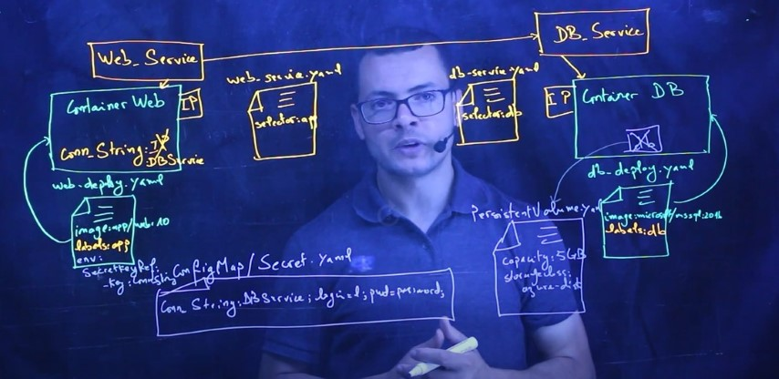

# Kube






## Get kubectl

```
curl -LO https://storage.googleapis.com/kubernetes-release/release/`curl -s https://storage.googleapis.com/kubernetes-release/release/stable.txt`/bin/linux/amd64/kubectl
chmod +x ./kubectl
mv ./kubectl /usr/local/bin/kubectl

cd ../..

kubectl create ns example-app

# lets create some resources.
kubectl apply -n example-app -f secrets/secret.yaml
kubectl apply -n example-app -f configmaps/configmap.yaml
kubectl apply -n example-app -f deployments/deployment.yaml

# remember to change the `type: LoadBalancer`
kubectl apply -n example-app -f services/service.yaml

```

## Connect to AKS

```
[Press connect in Azure Portal]
az account set --subscription <sub-id-FoundInAzureDashboard>
az aks get-credentials -n <yourClusterName> -g <yourResourceGroupName>
```

### Create an AKS cluster with ACR integration

`az aks create -n myAKSCluster -g myResourceGroup --generate-ssh-keys --attach-acr myACRName`

## Start the Kubernetes dashboard [DEPRECATED]

`az aks browse --resource-group myResourceGroup --name myAKSCluster`

## AKS: Quickly switching context between multiple clusters

```
az aks list -o table
kubectl config get-contexts
kubectl config use-context <yourClusterName>  #Switch cluster
kubectl config unset contexts.aws_cluster1-kubernetes #To unset context
kubectl config unset contexts #To unset all contexts
kubectl config view
```

## Kub Service SSL

https://docs.microsoft.com/en-us/azure/application-gateway/ingress-controller-expose-service-over-http-https

https://www.youtube.com/watch?v=5S_395VKMqs
1 https://cert-manager.io/docs/installation/kubernetes/

2 https://cert-manager.io/docs/concepts/issuer/

helm install cert-manager jetstack/cert-manager --namespace cert-manager --version v1.0.4 --set installCRDs=true

## Expose Port to Public

`kubectl expose pod test --type=NodePort --port=80 --target-port=5000`

## Port forwarding

```
kubectl -n yournamespace get pods
kubectl port-forward pod/mongo-db-r3pl1ka3 8080:5762
```
