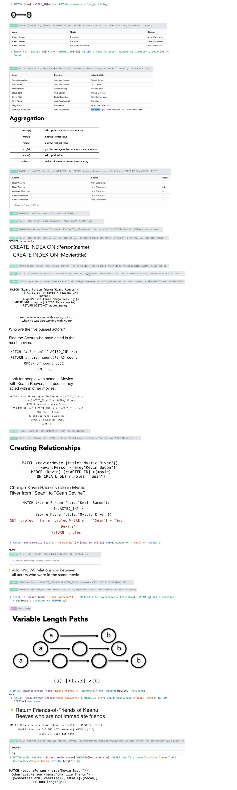

# Neo4j

<https://www.tutorialspoint.com/neo4j/neo4j_quick_guide.htm>

| #   | RDBMS            | Graph Database            |
| --- | ---------------- | ------------------------- |
| 1   | Tables           | Graphs                    |
| 2   | Rows             | Nodes                     |
| 3   | Columns and Data | Properties and its values |
| 4   | Constraints      | Relationships             |
| 5   | Joins            | Traversal                 |

| #   | Read           | Usage                                                                                              |
| --- | -------------- | -------------------------------------------------------------------------------------------------- |
| 1   | MATCH          | This clause is used to search the data with a specified pattern.                                   |
| 2   | OPTIONAL MATCH | Same as match, the only difference being it can use nulls in case of missing parts of the pattern. |
| 3   | WHERE          | To add contents to the CQL queries.                                                                |
| 4   | START          | To find the starting points through the legacy indexes.                                            |
| 5   | LOAD CSV       | To import data from CSV files.                                                                     |

| #   | Write         | Usage                                                                                                                           |
| --- | ------------- | ------------------------------------------------------------------------------------------------------------------------------- |
| 1   | CREATE        | To create nodes, relationships, and properties.                                                                                 |
| 2   | MERGE         | Verifies whether the specified pattern exists in the graph. If not, it creates the pattern.                                     |
| 3   | SET           | To update labels on nodes, properties on nodes and relationships.                                                               |
| 4   | DELETE        | To delete nodes and relationships or paths etc. from the graph.                                                                 |
| 5   | REMOVE        | To remove properties and elements from nodes and relationships.                                                                 |
| 6   | FOREACH       | To update the data within a list.                                                                                               |
| 7   | CREATE UNIQUE | Using the clauses CREATE and MATCH, you can get a unique pattern by matching the existing pattern and creating the missing one. |

| #   | General  | Usage                                                                                        |
| --- | -------- | -------------------------------------------------------------------------------------------- |
| 1   | RETURN   | To define what to include in the query result set.                                           |
| 2   | ORDER BY | To arrange the output of a query in order. It is used along with the clauses RETURN or WITH. |
| 3   | LIMIT    | To limit the rows in the result to a specific value.                                         |
| 4   | SKIP     | To define from which row to start including the rows in the output.                          |
| 5   | WITH     | To chain the query parts together.                                                           |
| 6   | UNWIND   | To expand a list into a sequence of rows.                                                    |
| 7   | UNION    | To combine the result of multiple queries.                                                   |
| 8   | CALL     | To invoke a procedure deployed in the database.                                              |

| #   | CQL Functions | Usage                                                            |
| --- | ------------- | ---------------------------------------------------------------- |
| 1   | String        | To work with String literals.                                    |
| 2   | Aggregation   | To perform some aggregation operations on CQL Query results.     |
| 3   | Relationship  | To get details of relationships such as startnode, endnode, etc. |

```sql
-- // BASIC
-- This query returns all the nodes in the database
MATCH (n) RETURN n

CREATE (node:label1{key1: value, ...}:label2:. . . . labeln)

CREATE (Dhawan:player{name: "Shikar Dhawan", YOB: 1985, POB: "Delhi"})
CREATE (Ind:Country {name: "India"})
-- Now, create a relationship named BATSMAN_OF between these two nodes as −
CREATE (Dhawan)-[r:BATSMAN_OF]->(Ind)

MATCH (a:player), (b:Country) WHERE a.name = "Shikar Dhawan" AND b.name = "India"
CREATE (a)-[r:BATSMAN_OF {Matches:5, Avg:90.75}]->(b)
RETURN a,b
```

## To see DB Structure

`CALL db.schema.visualization()`


