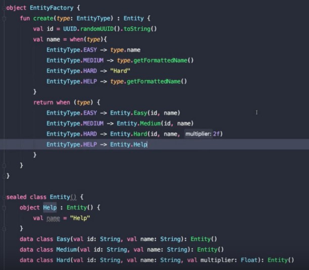

# Kotlin

## Basic

```kt
print("${HUman.message}")

<!-- Var -->
val letter: Char? = 'g' // Immutable
var letter: Char? = 'g' // Mutable (Changable)

<!-- IF -->

if (){}else{}       //same
when(age){       //SAME as SwitchCase
    1-> doThis()
    2,3,4-> println("hey")
    in 5..7-> do()
    else -> {
         print("x is neither 1 nor 2")
    }
}
val myvar = if (myBool) "hey" else "heyhey"
val myvar = when (myChar){
    'a'-> "hey"
    'b','c'-> "heyhey"
}

<!-- LOOP -->

for (j in 1..4) print(j) //RANGE

var x:Int = 0
while(x< = 10) {
    println(x)
    x++
}

do {
    x = x + 10
    println("I am inside Do block---"+x)
} while(x <= 50)
```

## Array

```kt
val numbers: IntArray = intArrayOf(1, 2, 3, 4, 5)
var arr: Array<Int> = arrayOf(2,5)

var arr = arrayOf("a","ge")
var lst = listOf("a","ge")  //immutable by default
var map = mapOf(1 to "a",3 to "ge")

for (i in arr.indices) { arr[i] }
for ((index, value) in items.withIndex())
    {println("$index is $value")}

<!-- COLLECTIONS -->

val numbers: MutableList<Int> = mutableListOf(1, 2, 3) //mutableList
val readOnlyView: List<Int> = numbers //immutableList
readOnlyView.clear()    // ⇒ does not compile - gives error

<!-- Break, Continue -->

myLabel@ for(x in 1..10) { // appling the custom label
   if(x = = 5) break@myLabel //specifing the label
   else continue@myLabel
}
```

## FUNC

```kt
//Type Unit = void
fun doubleMe(x:Int = 7):Int {
   return 2*x;
}

val multiply = {num1: Int, num2: Int-> num1*num2}
multiply(2,3)
```

## CLASS

Everything in Kotlin is by default final, hence, we need to use the keyword “open” in front of the class declaration to make it allowable to inherit.

```kt
open class Person(val firstName: String, var age: Int) {}

//more type of constructor
class HUman: people(val firstName: String, var age: Int){
   val message:String  = "Hey!!!"
   constructor(name : String , age :Int ,message :String):this(name,age) {}
}


//init runs before secondry constructor
class HUman: people(val firstName: String, var age: Int){
   init{
       do()
   }
   constructor(name : String):this(name,age) {
       do2()
   }
}

<!-- Anonymous Inner Class -->

Anonymous inner class is a pretty good concept that makes the life of a programmer very easy. Whenever we are implementing an interface, the concept of anonymous inner block comes into picture. The concept of creating an object of interface using runtime object reference is known as anonymous class.

fun main(args: Array<String>) {
   var programmer :Human = object:Human // creating an instance of the interface {
      override fun think() { // override ** must include
         print("I am an example of Anonymous Inner Class ")
      }
   }
   programmer.think()
}
interface Human {
   fun think()
}
```

## Visibility Control

```kt
class A() { protected val i = 1 }
class B : A() { fun getValue() : Int { return i } }
//“i” is declared as protected, hence, it is only visible to its subclass.

class internalExample {
   internal val i = 1
   internal fun doSomething(){}
//These two fields can be accessible only inside the package under 
```

## Setter Getter

```kt
var letter: Char? = 'g'
   set(value){
      field=value
   }
   get(){
      return field
   }

var letter: Char? = 'g'
   get() = 'X'
```

## NOT NULL

`x = myvar ?: "hello" //like ?? in C#`

## vararg

```kt
//like ... in java
fun foo(vararg strings: String) { /*...*/ }
foo(strings = *arrayOf("a", "b", "c"))
foo("a", "b", "c")
```

## Extension

```kt
class Alien {var skills : String = "null"}
fun main(args: Array<String>) {
   var  a3 = Alien()
   a3.MySkills()
}
fun Alien.MySkills():String{ //Extension
   return this.skills
}
```

## Sealed Class

This type of class is used to represent a restricted class hierarchy. Sealed allows the developers to maintain a data type of a predefined type.

```kt
sealed class MyExample {
   class OP1 : MyExample() // MyExmaple class can be of two types only
   class OP2 : MyExample()
}
fun main(args: Array<String>) {
   val obj: MyExample = MyExample.OP2()
   val output = when (obj) {
      is MyExample.OP1 -> "Option One has been chosen"
      is MyExample.OP2 -> "option Two has been chosen"
```



## Data Class

To hold the basic data

`data class Book(val name: String, val publisher: String)`

## filter/map

```kt
val mylist = listOf("C#","Java","JS",null)
mylist
   .filterNotNull()
   .filter{
      it.stratsWith('J')
   }
   .map{
      it.length
   }
   .forEach{
      println(it)
   }


//map items to their length
var map = mylist.associate{it to it.length}
map.forEach{
      println("${it.value} , ${it.key}")
   }
```

## Generic

```kt
fun main(args: Array<String>) {
   var objet = genericsExample<String>("JAVA")
   var objet1 = genericsExample<Int>(10)
}
class genericsExample<T>(input:T)
```

## Delegation

“by” / by lazy / Delegetion.Observable()

## lambda

```kt
fun main(args: Array<String>) {
   val mylambda:(String)->Unit  = {s:String->print(s)}
   myFun(mylambda) //passing lambda as a parameter
}
fun myFun(action: (String)->Unit) {
   action("hey")// call to lambda function
}
```

## Destructuring Declarations

```kt
val s = Student("TutorialsPoint.com","Kotlin")
val (name,subject) = s

data class Student( val a :String,val b: String ){
   var name:String = a
   var subject:String = b
}
```

## Exception

```kt
try {
} catch(e:Exception) {
   e.printStackTrace();
} finally {
}
```
