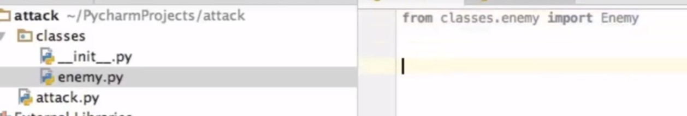
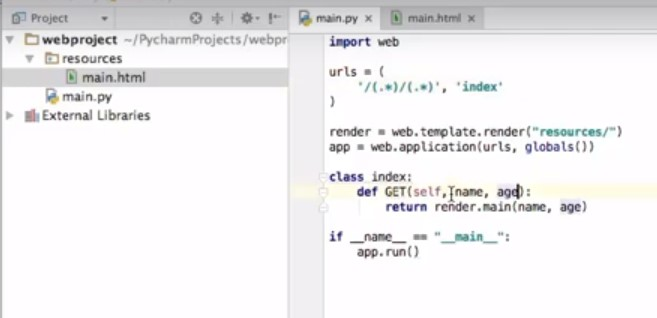

# Python

- http://pythonfiddle.com/
- https://github.com/Junnplus/awesome-python-books
- https://radimrehurek.com/gensim/
- https://www.pythonsheets.com/
- https://godjango.com/
- [An A-Z of useful Python tricks](https://medium.freecodecamp.org/an-a-z-of-useful-python-tricks-b467524ee747)
- [Writing Comments in Python](https://realpython.com/python-comments-guide/)
- [Look Ma, No For-Loops: Array Programming With NumPy](https://realpython.com/numpy-array-programming/#.W9dFkY85HMs.twitter)
- [Rich for rich text and beautiful formatting in the terminal](https://github.com/willmcgugan/rich)



## WebPy




## vEnv

```cmd
sudo apt-get install build-essential libssl-dev libffi-dev python-dev
sudo apt install python3-pip
sudo pip3 install virtualenv
virtualenv -p python3 env3
# Step : Activate your new Python 3 environment. There are two ways to do this
. env3/bin/activate # or source env3/bin/activate which does exactly the same thing
\venvName\Scripts\active #windows
deactivate
```

## Naming convention

```py
module_name
package_name
ClassName
method_name
ExceptionName
function_name
GLOBAL_CONSTANT_NAME
global_var_name
instance_var_name
function_parameter_name
local_var_name
```

## Basics

```py
# Multiine comment with '''x'''
dir(MyClass) # Shows available methods
help(foo) # Shows help comments for the method
eval('inlineCommand()') # to execute inline command
exec('''print('he')
a=2''')  # to execute multi-line command
from DIRECTORY import ClassName/FileName as cd
#| DIRECTORY >
#		| fileName.py {class ClassName}
#		| __init__.py {from fileName import ClassName}
del obj
raw_input() # Don’t use input(), eval, exec cause of security problems
** # Math.Pow
Var=8 if(1==1) else 9 # ?:
import sys; sys.argv # Get Input from CLI
x, _, y = (1,2,3) # x=1, y=3
x, *_, y = (1,2,3,4,5,6) # x=1, y=6, ignores in between
```

## String - immutable

```py
# ' for words | " for sentence | """ for multiline in CLI
f'Hello {obj}' # string format
import re # Regex Lib
print("\a") #beep
formattedStr = "%s - %d", ('Ali',33)
rawStr = r'hello\t' #gonna be hello\t
mStr.find('x') # indexOf
'-'.join(1,2,3) # 1-2-3
mStr.strip() # trim
mStr.strip("-") # trim - from start & end
mStr.lstrip() # left trim
mStr.rstrip() # right trim
mStr[2]= 'a' # ERROR - immutable
```

## Raise Exception

```py
raise <ExpType>, 'msg' # one way
assert(condition) # or if assert(false) then will raises exception
# Try Catch
try:
	foo
except IOError, e:
	bar
else:
	# if no exception appeared
finally:
	# run this no matter what
```

## ARRAY

```py
arr.remove(obj)
del arr[1:3] #[1,2,3,4,5] >> [1,5]
list(mTuple) # tuple to list
h_letters = [ letter for letter in 'human' ] #['h', 'u', 'm', 'a', 'n']
cmp(list1,list2) # compare
l.reverse(); l.sort()
x = [1, 2, 3]; x.append([4, 5]) # [1, 2, 3, [4, 5]]
x = [1, 2, 3]; x.extend([4, 5]) # [1, 2, 3, 4, 5]
l.pop(obj) # return and remove
b = a # copy by reference
b = a[:] # copy by value
```

## TUPLE - immutable

```py
tuple(mList) # list to tuple
def foo(*items): # like foo(int.. items) in JAVA
	for i in items:
		print(i)
```

## DICTIONARY

```py
zipped = zip(keysArr, valueArr) # [1,2],[3,4] > [(1,3), (2,4)]
(keysArr, valueArr) = *zipped # unzipping
d.items()
d.has_key(k); d.fromkeys(ks)
def f(**dic):
 for i in dic:
  print(i,dic[i]2)
```

## **name**

```py
# when run as the main program.
__name__ = "__main__" ### python foo.py
# when it's imported from another module.
__name__ = "foo" ### import foo
#
# EXAMPLE
#
print "Always executed"
if __name__ == "__main__":
 print "Executed when invoked directly"
else:
 print "Executed when imported"
```

## **str**, **repr** functions

```py
def __repr__(self):
	'''
	this will get printed when calling print(persionObject)
	using showing object properties for developers and debugging
	'''
	return "Person ('{}', '{}')".format(self.age, self.name)

def __str__(self):
	'''
	this will get returned str(persionObject)
	customize toString function
	'''
	return "PersonStr ('{}', '{}')".format(self.age, self.name)

def __add__(self, other):
	'customize concat function'
	if isinstance(other, Persion):
		return self.age + other.age
	  return NotImplemented

def __len__(self):
	'customize length function'
	return 0
```

## Lambda

`lambda p1, p2: p1*p2`

## Functions

```py
# Comment
def foo(a = 1.5: float) -> int:
	'func commenting'
	bar()
	return 2

# CallByObject
def foo(v):
	v += 1 # when u still the obj ref, you play with it and the original object will change
	v = 30 # but when you re-assign it, you will get disconnected from the original object. Now v, is like a local variable
	print(v) #30
v = 2
foo(v)
print(v) #3

# Scope
b=4
def foo():
	global b
	print(b)

# arg... in Python
def foo(*arg):
```

## \* & \*\*

```python
>>> def z(x):print(x);
...
>>> d = {'x':1}
>>> z(*d) //Arg
x
>>> z(**d)  //keyArg
1
```

```python
def foo(x,y):
    print('%s %s' % (x,y))

>>foo(*(1,2))
>>foo(*[1,2])

bar= (x* x for x in range(2))
>> foo(*bar) # 1 2

dic= {'a':1,'y':2}
>> foo(**dic) ## 1 2
```

```python
def foo(a,*b,**c): # only 'a' is required
	print(a)
	print(b)
	print(c)

>>>foo('hello',1,2,3,key1=1,keyX='3')
hello
(1,2,3)
{'key1':1 , 'keyX':'3'}
```

## Merging Dictionaries

```python
x={'a':1,'c':9}
y={'b':2,'a':3}
z={**x,**y} # {'a':3,'b':2,'c':9} -- right ones have higher priorities
```

## Type

```python
def x(a:int) -> int:
    return a + 1

# mypy xx.py
```

## is vs ==

"is" statement is a syntactic sugar for "id(a) == id(b)"

```python
a = [1,2,3]
b = a
c = [1,2,3] # or c = list(a) -> will clone

print(a==c) #True
print(a is c) #False
print(a==b) #True
print(a is b) #True
print(b==c) #True
print(b is c) #False
```

> ### برابری Equality
>
> توی پایتون وقتی می‌خواهیم ببینم دو آبجکت با هم برابر هستند یا خیر، از عملگرهای == و =! استفاده می‌کنیم.
>
> ### هویت Identity
>
> در مقابل‌ این عملگرها، دوتا عملگر دیگه هم داریم که is و is not هستند. is بررسی می‌کنه که آیا این آبجکت دقیقا یک آبجکت هستند یا نه. دقت کنید، یعنی اون دو متغییر دقیقاً در یک مکان از حافظه قرار گرفتند

## \_, \_\_

```python
class X:
	def __init__(self):
		self.foo = 1
		self._bar = 2
		self.__baz = 3
dir(X())
>>> [
	'_X__baz',	# private (to access private var, add _CLASS at first of the variable name)
	'_bar',		# public
	'foo'		# public
]
```

## return None, Implicit return

return None == return

```python
def foo():
	if(True): return 1
	else: return None
# SAME AS
def foo():
	if(True): return 1
```

## Switch alternative

```python
def foo(op,x,y):
	return {
		'add': lambda: x+y,
		'sub': lambda: x-y
	}.get(op,lambda: None)()
```

## Class

```py
class x (parentY, parentZ):
	'class doc'
	x.__doc__ #to see class doc
	def __init__(self): # constructor
	def __del__(self): # deconstructor
	issubclass(x,parentY) # bool
	isinstance(obj,x) # bool
	getattr();setattr();hasattr();delattr()
	self.__class__.__name__ #Get Class name in string
```

## SimpleHTTPServer

```py
python -m SimpleHTTPServer [<portNo>] #py2
python -m http.server [<portNo>] #py3
import SimpleHTTPServer
import SocketServer
PORT = 8000
Handler = SimpleHTTPServer.SimpleHTTPRequestHandler
httpd = SocketServer.TCPServer(("", PORT), Handler)
print "serving at port", PORT
httpd.serve_forever()
```

## Typing

```py
from typing import Sequence
myitems: Sequence[int] = []
myitems: List[int] = []
mytuple: Tuple[str, str] = ('','')

from typing import Union
from typing import Optional
def get_str_or_int(str_or_int: Union[str, int]):
def get_str_or_none() -> Union[str, None]:
def get_str_or_none() -> Optional[str]:
# Optional[str] == Union[str, None]

from typing import TypeVar
AnyStr = TypeVar('AnyStr', str, bytes) #anytype is str or bytes
# ** from typing import AnyStr
# ** AnyStr is part of library
def concat(a: AnyStr, b: AnyStr) -> AnyStr:
	return a + b
concat('a', b'b') #❌
concat('a', 'b') #✔
reveal_type(concat('a', 'b')) # str
reveal_type(concat(b'a', b'b')) # bytes

#CAST
from typing import cast
reveal_type(foo()) # Any
reveal_type(cast(Dict[str,int],foo())) # Dictionary[str,int]

# Stub (pyi) files
# Define types in interface class called file.pyi

# Using Monkeytype
# It will help to see what is the returning type of methods is
# $ pip install monkeytype
# $ monkeytype run file.py
# $ monkeytype stub file.py # will print out typed file
# $ monkeytype apply file.py
```
