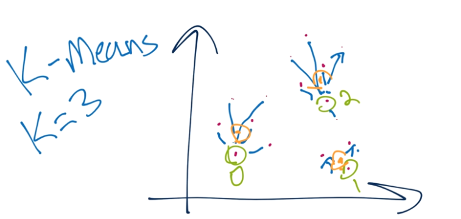

# Clustering

Clustering comes in two major forms: **Flat and Hierarchical**.

- With Flat clustering, the scientist **tells the machine** how many classes/clusters to find.
- With Hierarchical clustering, the machine **figures out** the groups and how many.

## K-Means



- Flat Clustering
- Know numbers of clusters = K.
- Find K centers `centroids` for K groups. Calculate distance using euclidean distance.

```py
from sklearn.cluster import KMeans
clf = KMeans(n_clusters=2)
clf.fit(X)
centroids = clf.cluster_centers_
labels = clf.labels_
```

## Mean Shift

- Hierarchical Clustering
- The Mean Shift algorithm finds clusters on its own. For this reason, it is even more of an "unsupervised" machine learning algorithm than K-Means.
- https://pythonprogramming.net/hierarchical-clustering-mean-shift-machine-learning-tutorial/

```py
from sklearn.cluster import MeanShift
ms = MeanShift()
ms.fit(X)
labels = ms.labels_
cluster_centers = ms.cluster_centers_
```


