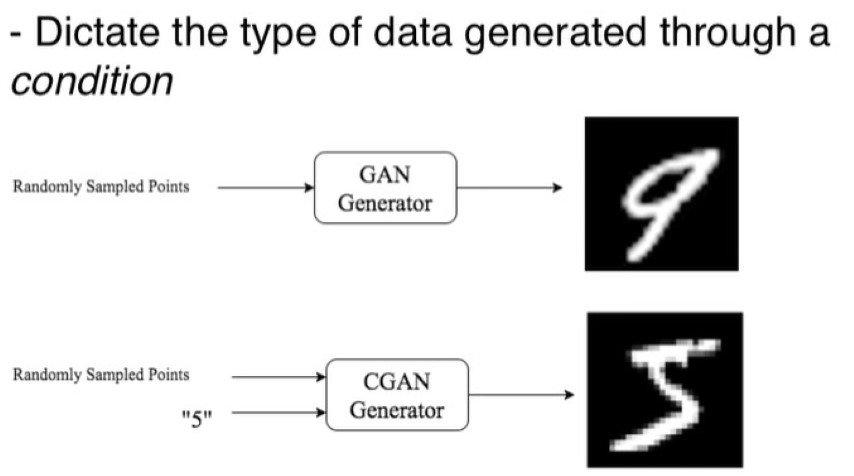
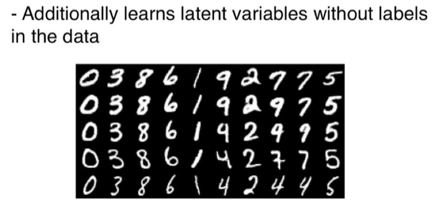
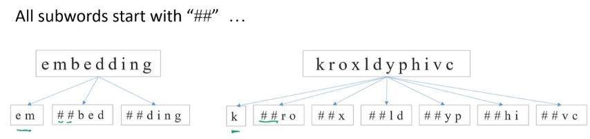
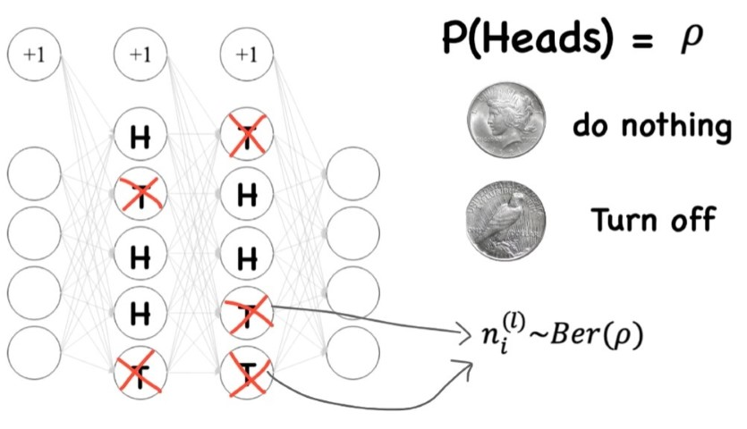
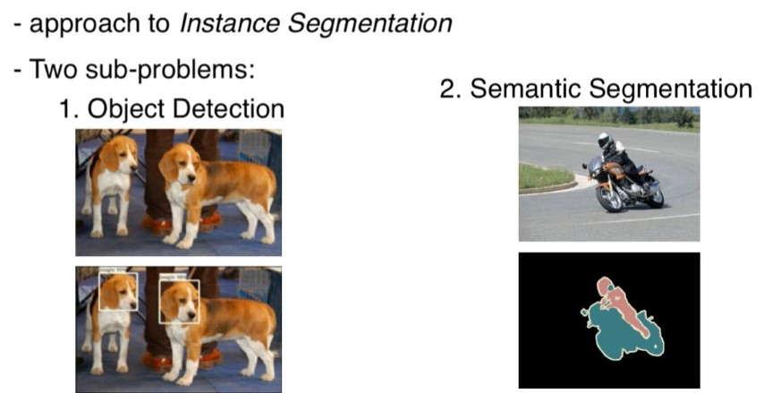
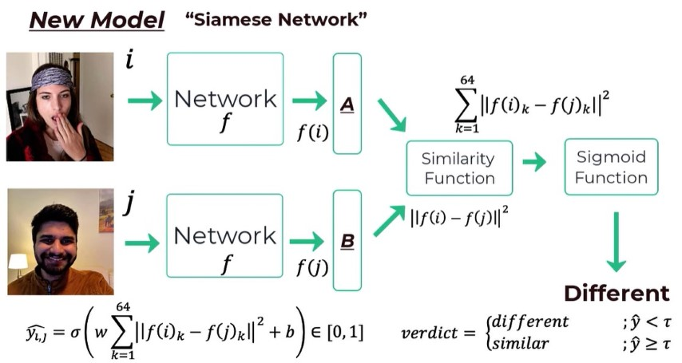
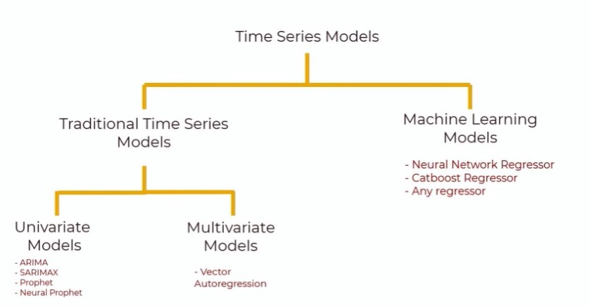
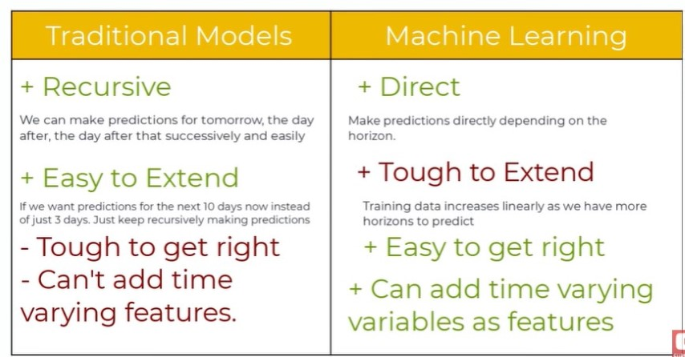

# Deep Learning - DNN

- When there is >=3 hidden layers in NN.
- Layers Count := | InputLayer + HiddenLayer |
- Best Blog Resource: <https://colah.github.io/>

## Activation Function

- <https://youtu.be/s-V7gKrsels>
- Usually use `softmax` activiation function at the last layer which it will normalize the result for us. ( all 0 to 1)
- For Regression: Don't need activation funciton.
- Use a nonlinear activation function for CNN.
- `reLu/Leaky reLu` typically used for activation function.
- `Leaky reLu` avoids the `dying reLu` problem.

## RNN - Recurrent Neural Network

- RNNs are the Feed Forward Neural Networks that are rolled out over time.
- Unlike normal Neural Networks, RNNs are designed to take a series of inputs with no predetermined limit on size. “Series” as in any input of that sequence has some relationship with their neighbour’s or have some influence on them.
- Basic feed forward networks “remember” things too, but they remember the things they learnt during training. While RNNs learn similarly while training, in addition, they remember things learnt from prior input(s) while generating output(s).
- Types of gatesHere are the different types of gates that we encounter in a typical recurrent neural network:
  - Input gate: Write to cell or not?
  - Forget gate: Erase a cell or not?
  - Gate: How much to write to cell?
  - Output : How much to reveal cell?
- <https://colah.github.io/posts/2015-08-Understanding-LSTMs/>

This way (BPTT - Back Propagation Through Time) has speed and storage problem. So we use Teacher Forcing to fix the issue.

RNN disadvantages:

- Slow to train.
- Long sequence leads to vanishing gradient or, say, the problem of long term dependencies. In simple terms, its memory is not that strong when it comes to remembering the old connection.

## seq2seq

The most popular and most used variant, take input as a sequence and give output as another sequence with variant sizes. Eg. Language translation, for time series data for stock market prediction.

## vec2seq

- Eg. Image Captioning
- Fixed size Input > Output Sequence

## seq2vec

- Eg. Sentiment Analysis
- Input of any length > Output Vector of fixed size

## Encoder Decoder

Seq 2 Vec 2 Seq: Used in Translation which they may have different input and ouput size.

## AutoEncoder

- <https://youtube.com/playlist?list=PLTl9hO2Oobd9ZXfLjfXpJ0zgZGeJQZ09a>
- https://pythonprogramming.net/autoencoders-tutorial/

- Some examples are in the form of compressing the number of input features and noise reduction.
- Output is not important, but the vector is what we care about.

Types:

- Sparce AutoEncoder
- Denoising AutoEncoder
- Variational Autoencoders

Used in:

- Image Segmentation
- Semantic Hashing
- Neural Inpainting (eg. Removing Watermarks)

## VAE - Variational Autoencoders

- **VAE is a GAN and AE.**
- AE Can't generate new data because we dont know how to assign values to the vector during the generation phase. (VAE is the solution)

How VAE solve this:

## GAN - Generative adversarial network

### DCGAN - Deep Convolutional GAN

- CNNs used in unsupervised learning
- Generators are Deconvolutional NN
- Discriminators are CNNs

### CoGAN - Coupled GAN

### CGAN - Confitional GAN

### Info GAN

### WGAN - Wasserstein GAN

- Replaces the old method of measuring loss, Jenson-Shannon Divergence with the new Wasserstein distance.
- We can now train discriminator until convergence, leading to higher quality samples generated by the generator.

### CycleGAN

- <https://www.youtube.com/watch?v=NyAosnNQv_U>
- https://junyanz.github.io/CycleGAN/

Cycle consistent adversarial networks for unpaired image-image translation. Some image-image translation problems include:

- Season Transfer
- Object Transfiguration
- Style transfer
- Photo Enhancement

## Transformer

- An encoder decoder architecture based on attention layers.
- One main difference is that the **input sequence can be passed parallelly**, so that **GPU** can be utilized effectively, and the speed of training can also be increased. And it is based on the multi-headed attention layer, vanishing gradient issue is also overcome by a large margin.
  

- <https://youtu.be/TQQlZhbC5ps>
- Implementation https://nlp.seas.harvard.edu/2018/04/03/attention.html

### Encoder Block

**Embedding Space - Word Embedding**: It’s like an open space or dictionary where words of similar meanings are grouped together or are present close to each other in that space.

But one other issue: every word in different sentences has different meanings. So, to solve this issue, we take the help of Positional Encoders. It is a vector that gives context according to the position of the word in a sentence.

Attention vector: For every word we can have an attention vector generated, which captures the contextual relationship between words in that sentence.

The only problem it faces is that for every word it weighs its value much higher on itself in the sentence, but we are inclined towards it’s interaction with other words of that sentence. So, we determine multiple attention vectors per words and take a weighted average, to compute final attention vector of every word.
As we are using multiple attention vectors, it is called the Multi-Head Attention Block.
Feed Forward Network accepts attention vectors “one at a time”.
And the best thing here is unlike the case of RNN, here each of these attention vectors are independent of each other. So, parallelization can be applied here, and that makes all the difference.

### Decoder Block

In Masked Multi-Head Attention Block we need to know how the learning mechanism works. First we give a English word, it will translate in it’s French version itself using previous results, then it will match and compare with the actual French translation (which we fed in the decoder block). After comparing both, it will update it’s matrix value. This is how it will learn after several iterations.

Now, the resulting attention vectors from the previous layer and the vectors from the Encoder Block are passed into another Multi-Head Attention Block. That’s why it is called Encoder-Decoder Attention Block. The output of this block is attention vectors for every word in English and French sentences. Each vector represents the relationship with other words in both the languages.

A linear layer is another feed forward layer. It is used to expand the dimensions into numbers of words in the Sanskrit language after translation.

Now it is passed through a Softmax Layer, which transforms the input into a probability distribution, which is human interpretable. And the resulting word is produced with highest probability after translation.

## BERT - Bidirectional Encoder Representations from Transformers

- Useful in Text Translation/Summarization because we have the future words.
- Created by stacking multiple encoders of Transformer.

### Word Embedding

- Play with code <https://colab.research.google.com/drive/1yFphU6PW9Uo6lmDly_ud9a6c4RCYlwdX>
- BERT is pre-trained and has fixed Vocabulary.
- It breaks down unknown words into subwords.

### Input Formatting

- **[SEP]**, to mark the end of a sentence, or the **separation** between two sentences
- **[CLS]**, at the beginning of our text. This token is used for **classification** tasks, but BERT expects it no matter what your application is.
- **[PAD]** Padding
- **[UNK]** Unknown Char
- **[MASK]**
- Tokens that conform with the fixed vocabulary used in BERT
- **The Token IDs** for the tokens, from BERT’s tokenizer
- **Mask IDs** to indicate which elements in the sequence are tokens and which are padding elements
- **Segment IDs** used to distinguish different sentences
- **Positional Embeddings** used to show token position within the sequence

### Advantages of Fine-Tuning

BERT already encodes a lot about our language.

1. Quicker Development
2. Less Data Required
3. Better Results

- C is binary. 1 if Sentence B follows Sentence A and 0 if it does not.
- Each T in WordVector that correspond to outputs for the masked language model problem. They have same size and generated simultaneously.

## GPT - Generative Pre-trained Transformer

Made by Stacking Decoders

## XLNet

## Attention

### Types of Attention

### Application of Attention

## LSTM - Long Short Term Memory

LSTM network is a type of RNN model that avoids the vanishing gradient problem by adding 'forget' gates.

<https://colah.github.io/posts/2015-08-Understanding-LSTMs/>

Recurring data goes through what is referred to as the Keep Gate or Forget Gate, basically which decides what to keep and zwhat to remove from the recurring data. From here, we get to the new input data, determining what new to add from it, then, finally, we decide what our new output will be.

- Sigmoid and Tahn activation function are useful in LSTM
- [MNIST - RNN with LSTM cell example in TensorFlow](https://pythonprogramming.net/rnn-tensorflow-python-machine-learning-tutorial/)
- To understand LSTM http://colah.github.io/posts/2015-08-Understanding-LSTMs/
- More Details <https://youtu.be/QciIcRxJvsM>

## GRU

Like LSTM but simpler

## CNN - Convolutional Neural Network

The basic CNN structure is as follows:

Convolution -> Pooling -> Convolution -> Pooling -> Fully Connected Layer -> Output

### Convolutional Layer

### Pooling Layer

- Stide = How many pixel to skip

## FC - Fully Connected Layer

- [MNIST CNN with TensorFlow](https://pythonprogramming.net/cnn-tensorflow-convolutional-nerual-network-machine-learning-tutorial/)
- [3D CNN on medical imaging data (CT Scans) for Kaggle](https://pythonprogramming.net/3d-convolutional-neural-network-machine-learning-tutorial/#Kaggle-Competition)
- [Classifying Cats vs Dogs with a CNN on Kaggle](https://pythonprogramming.net/convolutional-neural-network-kats-vs-dogs-machine-learning-tutorial/)
- [Using a NN to solve OpenAI's CartPole balancing environment](https://pythonprogramming.net/openai-cartpole-neural-network-example-machine-learning-tutorial/)

### Dropout Layer

- Randomly turning off neurouns in layers.
- Dropblock <https://www.youtube.com/watch?v=GcvGxXePI2

## What Filters learns

<https://youtu.be/eL80Im8Hq0k>

### Bilinear Interpolation

Upscalling or upsampling technique

### Activation function and masking

### Intersection over Union - IoU

A Metic messures overlap.

We need a dataset with the image and its corresponding masks for every single object in the image.

We determine the IoU for each of the object masks and our mask. The largest IoU is the classification that our network produces.

## Depthwise Separable Convolution

- A faster method of convolution with less computation power & parameters.
- Performing convolution with significantly less multiplication operation.
- Basiclly we are applying different filters to each individual channel (in Std Conv we apply to all).

## Masked R-CNN - Mask Region based Convolution Neural Networks

- Object Detection + Semantic Segmentation = Instance Segmentation
- Masked R-CNN achieves Instance Segmentation
- Faster R-CNN + FCN = Masked R-CNN
- Rol Align preserves spatial orientation of features with no loss of data

## Few Shot Learning

- There are applications wherein we neither have enough data for each class and the total number classes is huge as well as dynamically changing. Thus, the cost of data collection and periodical re-training is too high. On the other hand, in a one shot classification, we require only one training example for each class.
- One Shot Learning with Siamese Networks using Keras <https://towardsdatascience.com/one-shot-learning-with-siamese-networks-using-keras-17f34e75bb3d>

## Time series

<https://www.kaggle.com/freespirit08/time-series-for-beginners-with-arima>

Time Series is a series of observations taken at specified time intervals usually equal intervals. Analysis of the series helps us to predict future values based on previous observed values. In Time series, we have only 2 variables, time & the variable we want to forecast.

## Image Captioner

- <https://youtu.be/c_bVBYxX5EU>
- <https://github.com/yunjey/show-attend-and-tell>

## Siamese

- siamese cnn
- siamese lstm
- siamese bi-lstm
- siamese CapsuleNet

## Inception Network (also known as GoogLeNet)

This is a historically significant CNN design, having won the ImageNet recognition competition in 2014. The Inception model is also significant because it uses 12 times fewer parameters than the AlexNet.

Before further explaining how the Inception block works, we will quickly comment on the difference between Inception and other popular advanced CNN designs such as ResNet and DenseNet. ResNet and DenseNet increase the capacity of CNNs by increasing the depth of the network. This is done by adding shortcut connections that combat problems with feature redundancy.

Contrastingly, the Inception network focuses on the **width** of each layer, oppossed to the **depth** of the overall network. In more concrete terms, the Inception network presented in this paper contains 22 parametric layers, whereas ResNets or Highway networks usually contain over 100 layers.

### Inception Block: To shrink the depth of the feature map

(a). Stacking many different layers together. The Inception module copies the original input and feeds this same input to each of the different operations.

(b). we see that the input is initially passed through a 1x1 convolution before the 3x3, 5x5, and max-pool. This is done in order to reduce computational complexity, remember that a 1x1 convolution preserves the spatial dimensions of feature maps but can be used to decrease/increase the depth with the number of filters maps hyper-parameter.

### Intermediate Classifiers to Solve Vanishing Gradient

Intermediate Classifiers forces the intermediate features learned in this network to have discriminative features for the task at hand. With respect to the mechanisms used for implementation, the loss from each intermediate classifier is nerfed by a factor of 0.3 when updating the parameters via backpropagation.

## DenseNet

- <https://towardsdatascience.com/understanding-and-visualizing-densenets-7f688092391a>
- Counter-intuitively, by connecting this way DenseNets require fewer parameters than an equivalent traditional CNN, as there is no need to learn redundant feature maps.
- Furthermore, some variations of ResNets have proven that many layers are barely contributing and can be dropped. In fact, the number of parameters of ResNets are big because every layer has its weights to learn. Instead, DenseNets layers are very narrow (e.g. 12 filters), and they just add a small set of new feature-maps.
- Another problem with very deep networks was the problems to train, because of the mentioned flow of information and gradients. DenseNets solve this issue since each layer has direct access to the gradients from the loss function and the original input image.

## CapsuleNet

??
