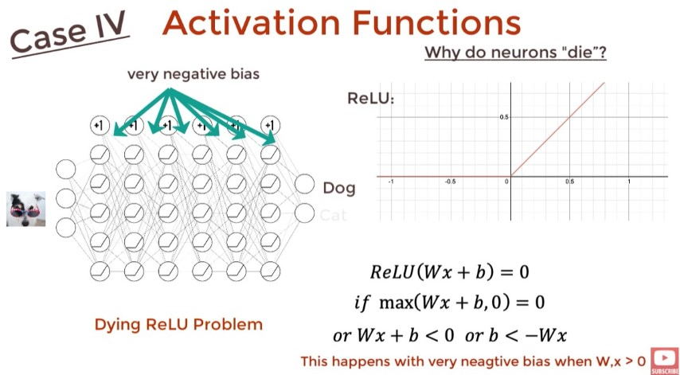
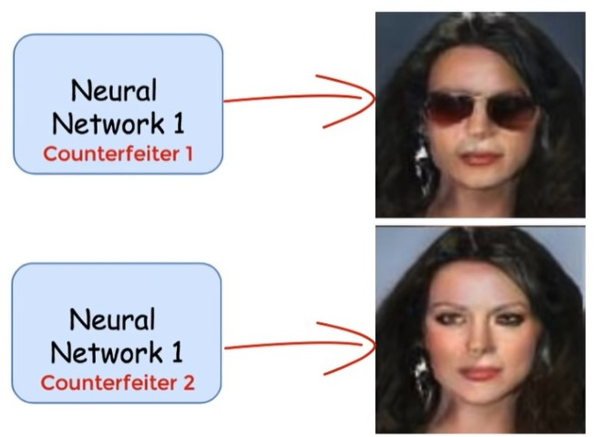

# Deep Learning - DNN

- When there is >=3 hidden layers in NN.
- Layers Count := | InputLayer + HiddenLayer |
- Best Blog Resource: <https://colah.github.io/>

## Activation Function

- <https://youtu.be/s-V7gKrsels>
- Usually use `softmax` activiation function at the last layer which it will normalize the result for us.
- For Regression: Don't need activation funciton.
- Use a nonlinear activation function for CNN.
- `reLu/Leaky reLu` typically used for activation function.
- `Leaky reLu` avoids the `dying reLu` problem.

## RNN - Recurrent Neural Network

- RNNs are the Feed Forward Neural Networks that are rolled out over time.
- Unlike normal Neural Networks, RNNs are designed to take a series of inputs with no predetermined limit on size. “Series” as in any input of that sequence has some relationship with their neighbour’s or have some influence on them.
- Basic feed forward networks “remember” things too, but they remember the things they learnt during training. While RNNs learn similarly while training, in addition, they remember things learnt from prior input(s) while generating output(s).
- <https://colah.github.io/posts/2015-08-Understanding-LSTMs/>

This way (BPTT - Back Propagation Through Time) has speed and storage problem. So we use Teacher Forcing to fix the issue.

RNN disadvantages:

- Slow to train.
- Long sequence leads to vanishing gradient or, say, the problem of long term dependencies. In simple terms, its memory is not that strong when it comes to remembering the old connection.

## seq2seq

The most popular and most used variant, take input as a sequence and give output as another sequence with variant sizes. Eg. Language translation, for time series data for stock market prediction.

## vec2seq

- Eg. Image Captioning
- Fixed size Input > Output Sequence

## seq2vec

- Eg. Sentiment Analysis
- Input of any length > Output Vector of fixed size

## Encoder Decoder

Seq 2 Vec 2 Seq: Used in Translation which they may have different input and ouput size.

## AutoEncoder

<https://youtube.com/playlist?list=PLTl9hO2Oobd9ZXfLjfXpJ0zgZGeJQZ09a>

Output is not important, but the vector is what we care about.

Types:

- Sparce AutoEncoder
- Denoising AutoEncoder
- Variational Autoencoders

Used in:

- Image Segmentation
- Semantic Hashing
- Neural Inpainting (eg. Removing Watermarks)

## VAE - Variational Autoencoders

- **VAE is a GAN and AE.**
- AE Can't generate new data because we dont know how to assign values to the vector during the generation phase. (VAE is the solution)

How VAE solve this:

## GAN - Generative adversarial network

### DCGAN - Deep Convolutional GAN

### CoGAN - Coupled GAN

## Transformer

- An encoder decoder architecture based on attention layers.
- One main difference is that the **input sequence can be passed parallelly**, so that **GPU** can be utilized effectively, and the speed of training can also be increased. And it is based on the multi-headed attention layer, vanishing gradient issue is also overcome by a large margin.
  
- <https://youtu.be/TQQlZhbC5ps>

### Encoder Block

Embedding Space: It’s like an open space or dictionary where words of similar meanings are grouped together or are present close to each other in that space.

But one other issue: every word in different sentences has different meanings. So, to solve this issue, we take the help of Positional Encoders. It is a vector that gives context according to the position of the word in a sentence.

Attention vector: For every word we can have an attention vector generated, which captures the contextual relationship between words in that sentence.

The only problem it faces is that for every word it weighs its value much higher on itself in the sentence, but we are inclined towards it’s interaction with other words of that sentence. So, we determine multiple attention vectors per words and take a weighted average, to compute final attention vector of every word.
As we are using multiple attention vectors, it is called the Multi-Head Attention Block.
Feed Forward Network accepts attention vectors “one at a time”.
And the best thing here is unlike the case of RNN, here each of these attention vectors are independent of each other. So, parallelization can be applied here, and that makes all the difference.

### Decoder Block

In Masked Multi-Head Attention Block we need to know how the learning mechanism works. First we give a English word, it will translate in it’s French version itself using previous results, then it will match and compare with the actual French translation (which we fed in the decoder block). After comparing both, it will update it’s matrix value. This is how it will learn after several iterations.

Now, the resulting attention vectors from the previous layer and the vectors from the Encoder Block are passed into another Multi-Head Attention Block. That’s why it is called Encoder-Decoder Attention Block. The output of this block is attention vectors for every word in English and French sentences. Each vector represents the relationship with other words in both the languages.

A linear layer is another feed forward layer. It is used to expand the dimensions into numbers of words in the Sanskrit language after translation.

Now it is passed through a Softmax Layer, which transforms the input into a probability distribution, which is human interpretable. And the resulting word is produced with highest probability after translation.

## BERT - Bidirectional Encoder Representations from Transformers

- Useful in Text Translation/Summarization because we have the future words.
- Created by stacking multiple encoders of Transformer.

- C is binary. 1 if Sentence B follows Sentence A and 0 if it does not.
- Each T in WordVector that correspond to outputs for the masked language model problem. They have same size and generated simultaneously.

## GPT - Generative Pre-trained Transformer

Made by Stacking Decoders

## XLNet

## Attention

### Types of Attention

### Application of Attention

## LSTM - Long Short Term Memory

<https://colah.github.io/posts/2015-08-Understanding-LSTMs/>

Recurring data goes through what is referred to as the Keep Gate or Forget Gate, basically which decides what to keep and what to remove from the recurring data. From here, we get to the new input data, determining what new to add from it, then, finally, we decide what our new output will be.

- Sigmoid and Tahn activation function are useful in LSTM
- [MNIST - RNN with LSTM cell example in TensorFlow](https://pythonprogramming.net/rnn-tensorflow-python-machine-learning-tutorial/)
- To understand LSTM http://colah.github.io/posts/2015-08-Understanding-LSTMs/
- More Details <https://youtu.be/QciIcRxJvsM>

## GRU

Like LSTM but simpler

## CNN - Convolutional Neural Network

The basic CNN structure is as follows:

Convolution -> Pooling -> Convolution -> Pooling -> Fully Connected Layer -> Output

### Convolutional Layer

### Pooling Layer

- Stide = How many pixel to skip

## FC - Fully Connected Layer

- [MNIST CNN with TensorFlow](https://pythonprogramming.net/cnn-tensorflow-convolutional-nerual-network-machine-learning-tutorial/)
- [3D CNN on medical imaging data (CT Scans) for Kaggle](https://pythonprogramming.net/3d-convolutional-neural-network-machine-learning-tutorial/#Kaggle-Competition)
- [Classifying Cats vs Dogs with a CNN on Kaggle](https://pythonprogramming.net/convolutional-neural-network-kats-vs-dogs-machine-learning-tutorial/)
- [Using a NN to solve OpenAI's CartPole balancing environment](https://pythonprogramming.net/openai-cartpole-neural-network-example-machine-learning-tutorial/)

## What Filters learns

<https://youtu.be/eL80Im8Hq0k>

### Bilinear Interpolation

Upscalling technique

### Activation function and masking

### Intersection over Union - IoU

A Metic messures overlap.

We need a dataset with the image and its corresponding masks for every single object in the image.

We determine the IoU for each of the object masks and our mask. The largest IoU is the classification that our network produces.

## Depthwise Separable Convolution

A faster method of convolution with less computation power & parameters.

## CapsuleNet

## Siamese

- siamese cnn
- siamese lstm
- siamese bi-lstm
- siamese CapsuleNet

## Time series data
