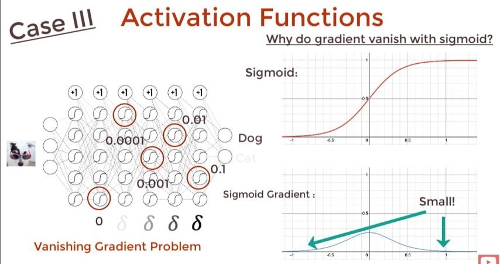
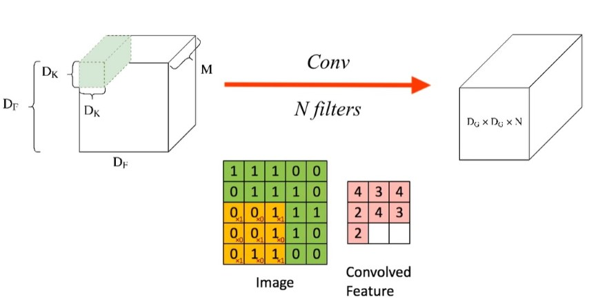

# Deep Learning - DNN

- When there is >=3 hidden layers in NN.
- Layers Count := | InputLayer + HiddenLayer |

## Activation Function

- <https://youtu.be/s-V7gKrsels>
- Usually use `softmax` activiation function at the last layer which it will normalize the result for us.
- For Regression: Don't need activation funciton.
- Use a nonlinear activation function for CNN.
- `reLu/Leaky reLu` typically used for activation function.
- `Leaky reLu` avoids the `dying reLu` problem.

## RNN - Recurrent Neural Network

Another way to look at this is more like this:

More Details <https://youtu.be/yZv_yRgOvMg>

This way (BPTT - Back Propagation Through Time) has speed and storage problem. So we use Teacher Forcing to fix the issue.

## seq2seq

## seq2vec

- Eg. Sentiment Analysis

## vec2seq

- Eg. Image Captioning

## Encoder Decoder

Seq 2 Vec 2 Seq: Used in Translation which they may have different input and ouput size.

## AutoEncoder

<https://youtube.com/playlist?list=PLTl9hO2Oobd9ZXfLjfXpJ0zgZGeJQZ09a>

Output is not important, but the vector is what we care about.

Types:

- Sparce AutoEncoder
- Denoising AutoEncoder
- Variational Autoencoders

Used in:

- Image Segmentation
- Semantic Hashing
- Neural Inpainting (eg. Removing Watermarks)

## VAE - Variational Autoencoders

- **VAE is a GAN and AE.**
- AE Can't generate new data because we dont know how to assign values to the vector during the generation phase. (VAE is the solution)

How VAE solve this:

## GAN - Generative adversarial network

## BERT

- Useful in Text Translation/Summarization because we have the future words.

## LSTM - Long Short Term Memory

Recurring data goes through what is referred to as the Keep Gate or Forget Gate, basically which decides what to keep and what to remove from the recurring data. From here, we get to the new input data, determining what new to add from it, then, finally, we decide what our new output will be.

- Sigmoid and Tahn activation function are useful in LSTM
- [MNIST - RNN with LSTM cell example in TensorFlow](https://pythonprogramming.net/rnn-tensorflow-python-machine-learning-tutorial/)
- To understand LSTM http://colah.github.io/posts/2015-08-Understanding-LSTMs/
- More Details <https://youtu.be/QciIcRxJvsM>

## GRU

Like LSTM but simpler

## CNN - Convolutional Neural Network

The basic CNN structure is as follows:

Convolution -> Pooling -> Convolution -> Pooling -> Fully Connected Layer -> Output

### Convolutional Layer

### Pooling Layer

- Stide = How many pixel to skip

## FC - Fully Connected Layer

- [MNIST CNN with TensorFlow](https://pythonprogramming.net/cnn-tensorflow-convolutional-nerual-network-machine-learning-tutorial/)
- [3D CNN on medical imaging data (CT Scans) for Kaggle](https://pythonprogramming.net/3d-convolutional-neural-network-machine-learning-tutorial/#Kaggle-Competition)
- [Classifying Cats vs Dogs with a CNN on Kaggle](https://pythonprogramming.net/convolutional-neural-network-kats-vs-dogs-machine-learning-tutorial/)
- [Using a NN to solve OpenAI's CartPole balancing environment](https://pythonprogramming.net/openai-cartpole-neural-network-example-machine-learning-tutorial/)

## CapsuleNet

## Siamese

- siamese cnn
- siamese lstm
- siamese bi-lstm
- siamese CapsuleNet

## Time series data
