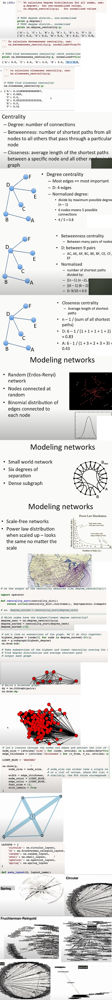

# Graph Analysis

## Tools

- Gephi
- Nx

## Nx Library

<https://github.com/networkx/networkx>

```py
import networkx as nx
# pip install networkx[all]
G = nx.from_pandas_edgelist(df=d, source=column_ID, target=column_ID+'_2', edge_attr=column_edge)
G.add_nodes_from(nodes_for_adding=df.ID.tolist())
```


