# Image Processing

## Feature Detector vs Descriptor

- An **interest point** (key point, salient point) detector is an algorithm that chooses points from an image based on some criterion. Typically, an interest point is a local maximum of some function, such as a "cornerness" metric.

- A **descriptor** is a vector of values, which somehow describes the image patch around an interest point. It could be as simple as the raw pixel values, or it could be more complicated, such as a histogram of gradient orientations.

- Together an interest point and its descriptor is usually called a local feature. **Local features** are used for many computer vision tasks, such as image registration, 3D reconstruction, object detection, and object recognition.

- **Harris, Min Eigen, and FAST** are interest point detectors, or more specifically, corner detectors.

- **SIFT** includes both a detector and a descriptor. The detector is based on the difference-of-Gaussians (DoG), which is an approximation of the Laplacian. The DoG detector detects centers of blob-like structures. The SIFT descriptor is a based on a histogram of gradient orientations.

- **SURF** is meant to be a fast approximation of SIFT.

- **BRISK**, like SIFT and SURF, includes a detector and a descriptor. The detector is a corner detector. The descriptor is a binary string representing the signs of the difference between certain pairs of pixels around the interest point.

## Features

- Edges

  Edges are points where there is a boundary (or an edge) between two image regions. In general, an edge can be of almost arbitrary shape, and may include junctions. In practice, edges are usually defined as sets of points in the image which have a strong gradient magnitude. Furthermore, some common algorithms will then chain high gradient points together to form a more complete description of an edge. These algorithms usually place some constraints on the properties of an edge, such as shape, smoothness, and gradient value.
  Locally, edges have a one-dimensional structure.

- Corners / interest points

  The terms corners and interest points are used somewhat interchangeably and refer to point-like features in an image, which have a local two dimensional structure. The name "Corner" arose since early algorithms first performed edge detection, and then analysed the edges to find rapid changes in direction (corners). These algorithms were then developed so that explicit edge detection was no longer required, for instance by looking for high levels of curvature in the image gradient. It was then noticed that the so-called corners were also being detected on parts of the image which were not corners in the traditional sense (for instance a small bright spot on a dark background may be detected). These points are frequently known as interest points, but the term "corner" is used by tradition.

- Blobs / regions of interest points

  Blobs provide a complementary description of image structures in terms of regions, as opposed to corners that are more point-like. Nevertheless, blob descriptors may often contain a preferred point (a local maximum of an operator response or a center of gravity) which means that many blob detectors may also be regarded as interest point operators. Blob detectors can detect areas in an image which are too smooth to be detected by a corner detector.

  Consider shrinking an image and then performing corner detection. The detector will respond to points which are sharp in the shrunk image, but may be smooth in the original image. It is at this point that the difference between a corner detector and a blob detector becomes somewhat vague. To a large extent, this distinction can be remedied by including an appropriate notion of scale. Nevertheless, due to their response properties to different types of image structures at different scales, the LoG and DoH blob detectors are also mentioned in the article on corner detection.

- Ridges

  For elongated objects, the notion of ridges is a natural tool. A ridge descriptor computed from a grey-level image can be seen as a generalization of a medial axis. From a practical viewpoint, a ridge can be thought of as a one-dimensional curve that represents an axis of symmetry, and in addition has an attribute of local ridge width associated with each ridge point. Unfortunately, however, it is algorithmically harder to extract ridge features from general classes of grey-level images than edge-, corner- or blob features. Nevertheless, ridge descriptors are frequently used for road extraction in aerial images and for extracting blood vessels in medical images.

## Feature Detectors

<table class="wikitable"> <caption>Common feature detectors and their classification: </caption> <tbody><tr> <th>Feature detector</th> <th><a href="https://en.wikipedia.org/wiki/Edge_detection" title="Edge detection">Edge</a></th> <th><a href="https://en.wikipedia.org/wiki/Corner_detection" title="Corner detection">Corner</a></th> <th><a href="https://en.wikipedia.org/wiki/Blob_detection" title="Blob detection">Blob</a> </th></tr> <tr> <td><a href="https://en.wikipedia.org/wiki/Canny_edge_detector" title="Canny edge detector">Canny</a> </td> <td>X </td> <td> </td> <td> </td></tr> <tr> <td><a href="https://en.wikipedia.org/wiki/Sobel_operator" title="Sobel operator">Sobel</a> </td> <td>X </td> <td> </td> <td> </td></tr> <tr> <td><a href="/w/index.php?title=Kayyali_operator&amp;action=edit&amp;redlink=1" class="new" title="Kayyali operator (page does not exist)">Kayyali</a> </td> <td>X </td> <td> </td> <td> </td></tr> <tr> <td><a href="https://en.wikipedia.org/wiki/Corner_detection#The_Harris_&amp;_Stephens_/_Plessey_/_Shi–Tomasi_corner_detection_algorithms" title="Corner detection">Harris &amp; Stephens / Plessey / Shi–Tomasi</a> </td> <td>X </td> <td>X </td> <td> </td></tr> <tr> <td><a href="https://en.wikipedia.org/wiki/Corner_detection#The_SUSAN_corner_detector" title="Corner detection">SUSAN</a> </td> <td>X </td> <td>X </td> <td> </td></tr> <tr> <td><a href="https://en.wikipedia.org/wiki/Corner_detection#The_Shi_and_Tomasi_corner_detection_algorithm" title="Corner detection">Shi &amp; Tomasi</a> </td> <td> </td> <td>X </td> <td> </td></tr> <tr> <td><a href="https://en.wikipedia.org/wiki/Corner_detection#The_level_curve_curvature_approach" title="Corner detection">Level curve curvature</a> </td> <td> </td> <td>X </td> <td> </td></tr> <tr> <td><a href="https://en.wikipedia.org/wiki/Features_from_accelerated_segment_test" title="Features from accelerated segment test">FAST</a> </td> <td> </td> <td>X </td> <td>X </td></tr> <tr> <td><a href="https://en.wikipedia.org/wiki/Blob_detection#The_Laplacian_of_Gaussian" title="Blob detection">Laplacian of Gaussian</a> </td> <td> </td> <td>X </td> <td>X </td></tr> <tr> <td><a href="https://en.wikipedia.org/wiki/Difference_of_Gaussians" title="Difference of Gaussians">Difference of Gaussians</a> </td> <td> </td> <td>X </td> <td>X </td></tr> <tr> <td><a href="https://en.wikipedia.org/wiki/Blob_detection#The_determinant_of_the_Hessian" title="Blob detection">Determinant of Hessian</a> </td> <td> </td> <td>X </td> <td>X </td></tr> <tr> <td><a href="https://en.wikipedia.org/wiki/MSER" class="mw-redirect" title="MSER">MSER</a> </td> <td> </td> <td> </td> <td>X </td></tr> <tr> <td><a href="https://en.wikipedia.org/wiki/Principal_Curvature-Based_Region_Detector" class="mw-redirect" title="Principal Curvature-Based Region Detector">PCBR</a> </td> <td> </td> <td> </td> <td>X </td></tr> <tr> <td><a href="https://en.wikipedia.org/wiki/Blob_detection#Grey-level_blobs,_grey-level_blob_trees_and_scale-space_blobs" title="Blob detection">Grey-level blobs</a> </td> <td> </td> <td> </td> <td>X </td></tr></tbody></table>

## Visual Descriptors

1. **Color Descriptors**

   - Dominant color,
   - Color Layout (essentially Primary color on block-by-block basis)
   - Scalable Color (essentially Color histogram),
   - Color Structure (essentially local Color histogram)
   - Color spaces to make things interoperable.

2. **Texture Descriptors**

   - Texture Browsing Descriptor - which defines granularity/coarseness, regularity,and direction.
   - Homogeneous Texture Descriptor - which is based on Gabor filter bank
   - Edge Histogram

3. **Shape Descriptors**

   - Region based descriptors are scalar attributes of shape under consideration - such as area, ecentricities etc.
   - Contour based which captures actual characteristic shape features and
   - 3D descriptors

4. **Motion Descriptors for Video**

   - Camera Motion (3-D camera motion parameters)
   - Motion Trajectory (of objects in the scene) [e.g. extracted by tracking algorithms]
   - Parametric Motion (e.g. motion vectors, which allows description of motion of scene. But it can be more complex models on various objects).
   - Activity which is more of a semantic descriptor.

## Filters

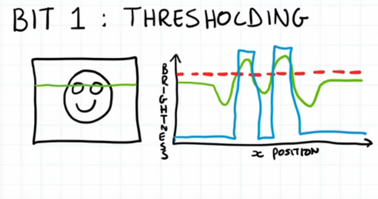
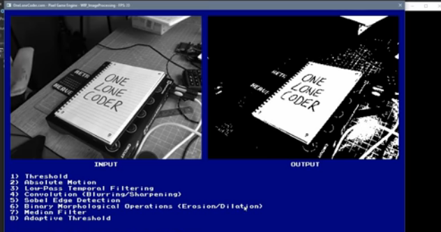
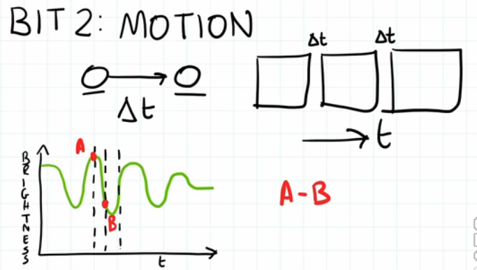
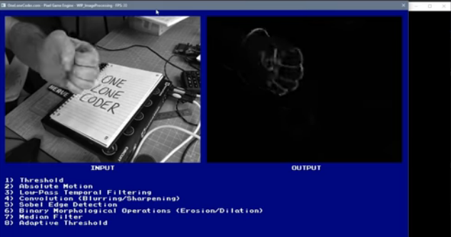
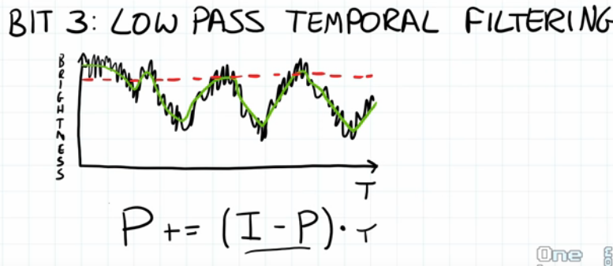
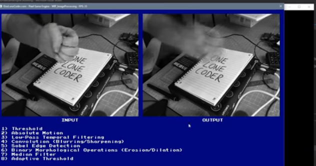
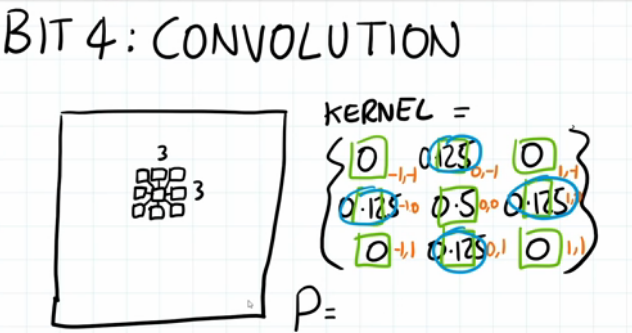
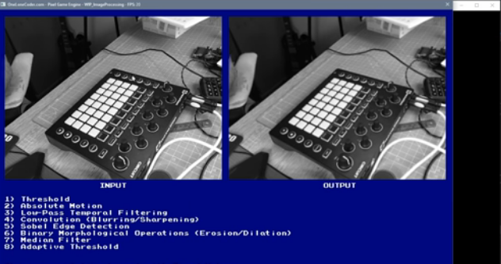
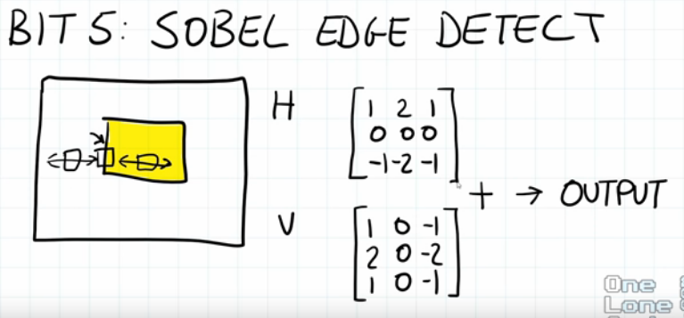
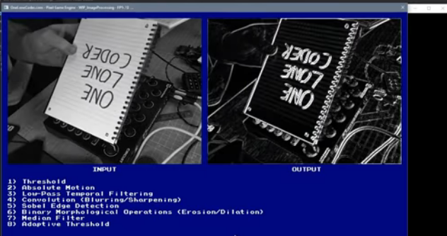
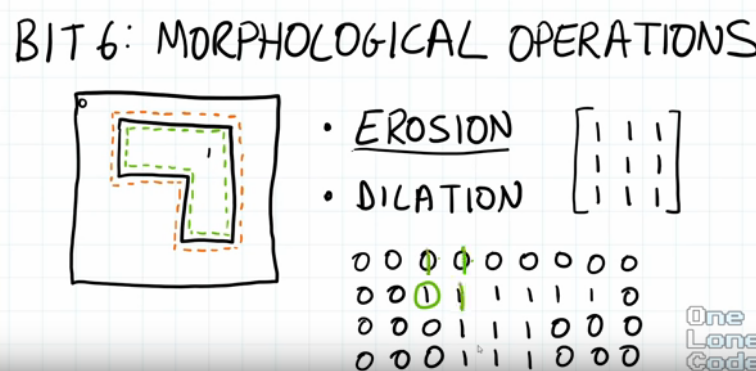
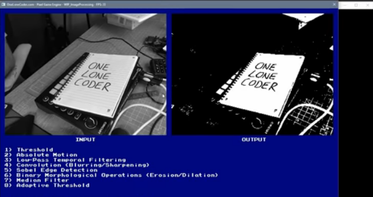
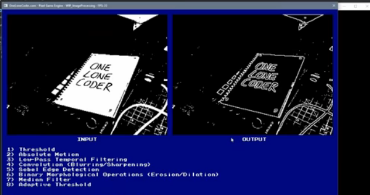
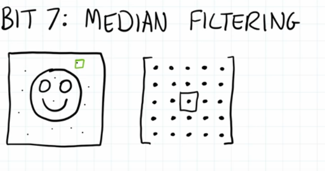
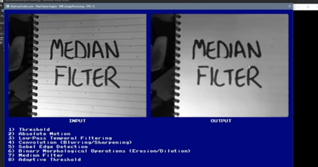
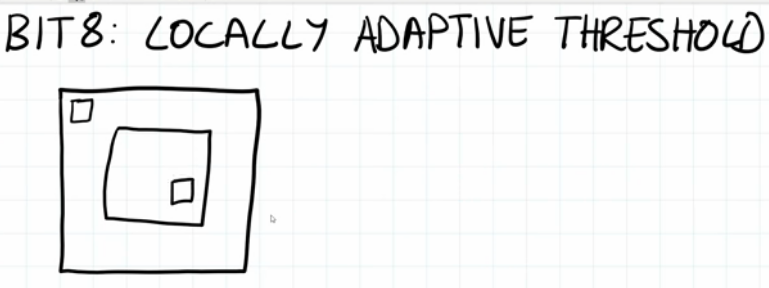
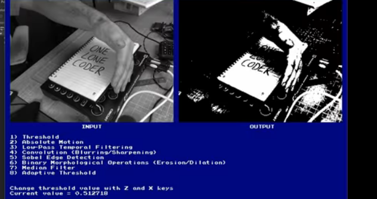
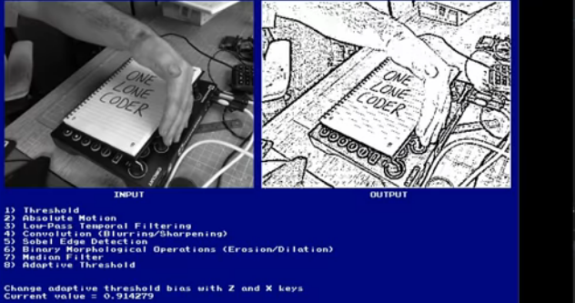
