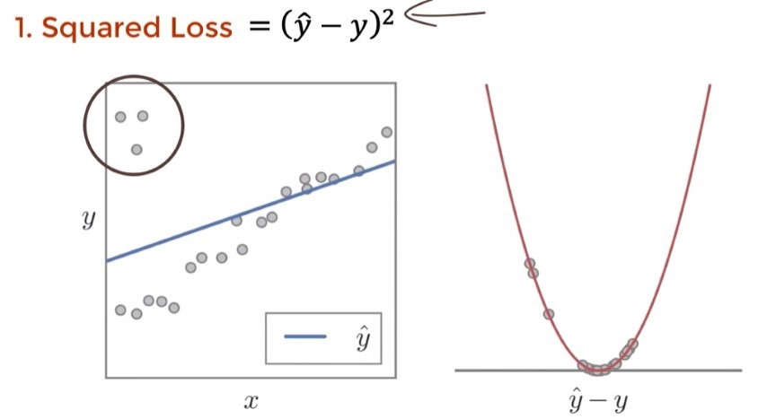
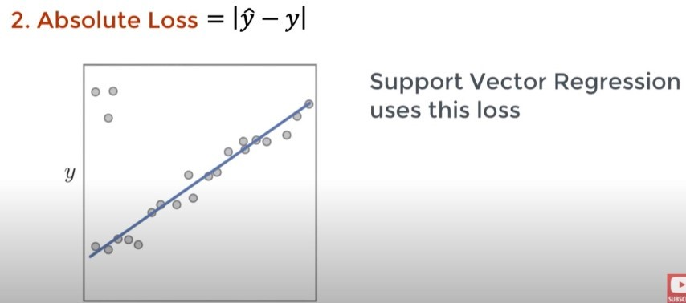
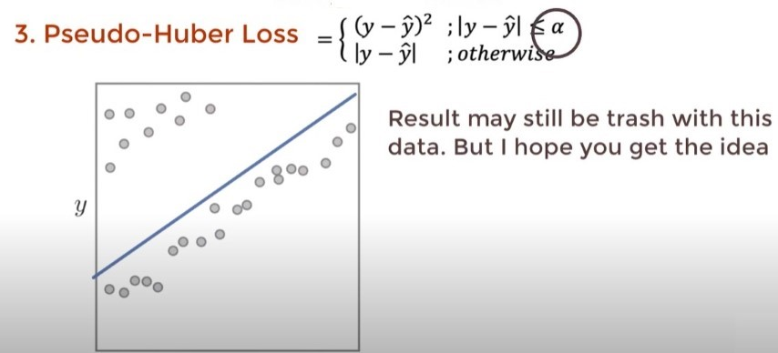
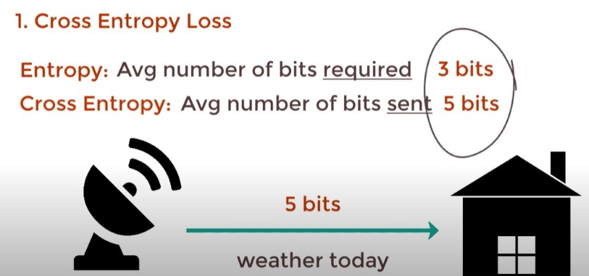
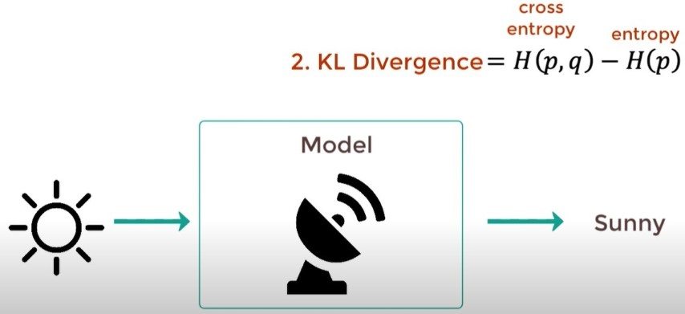
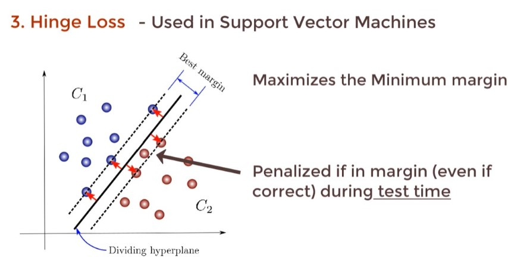
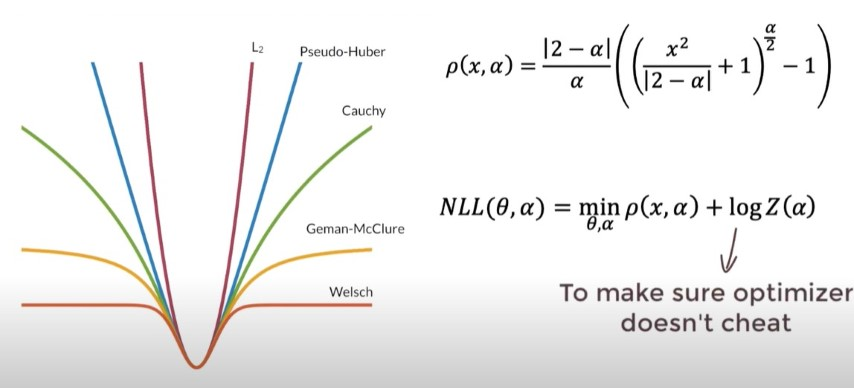
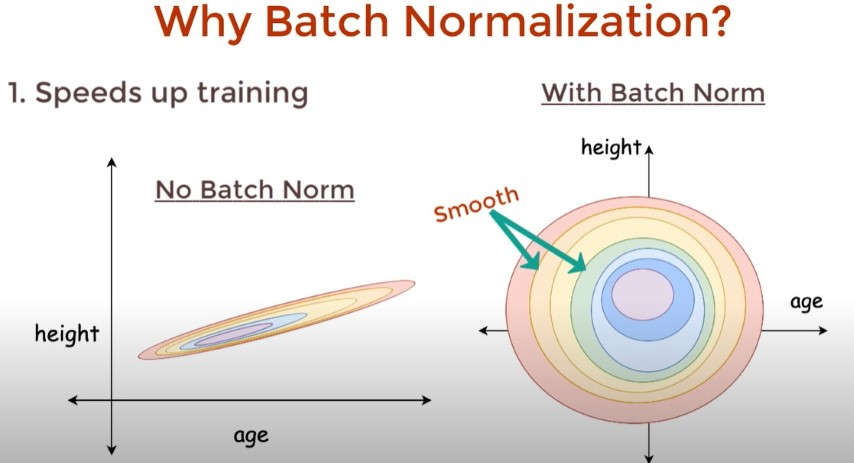
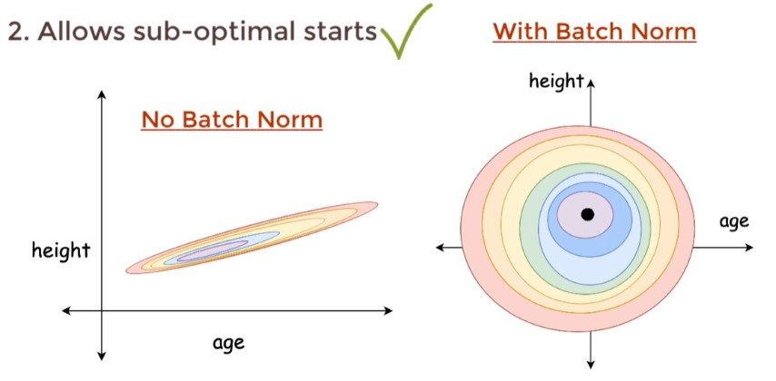
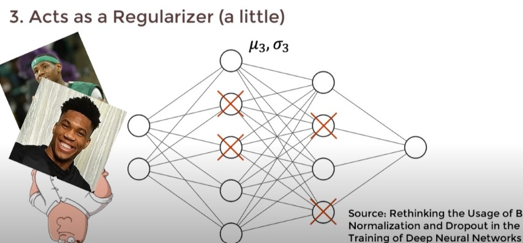

# ML

## Points

- `model.summery()` will print model structure > ex. FC | (NONE `is mini_batch`, 64).

## Convert Text to Number

```py
CATEGORIES = ["Dog", "Cat"]
class_num = CATEGORIES.index("Cat") #1
```

## Loss Function

<https://youtu.be/QBbC3Cjsnjg>

In Regression





In Classification





There are more Loss functions, but we can use Adaptive Loss.

All losses have general equaltion, by using maximum likelihood estimation we will find our best Loss method.




## Optimzers


- <https://youtu.be/mdKjMPmcWj>
- Blog with more details <https://ruder.io/optimizing-gradient-descent/index.html#adagrad>

Gradient descent variants

- Batch gradient descent
- Stochastic gradient descent
- Mini-batch gradient descent

Gradient descent optimization algorithms

- Momentum
- Nesterov accelerated gradient
- Adagrad
- Adadelta
- RMSprop
- Adam
- AdaMax
- Nadam
- AMSGrad
- Other recent optim

## Batch Normalization





Like Dropout, but does not replace it and we still use dropout for better results.
