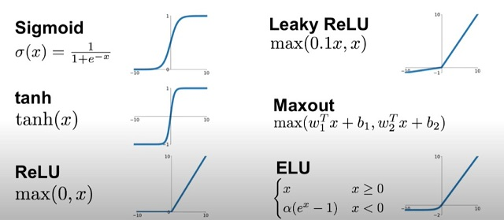
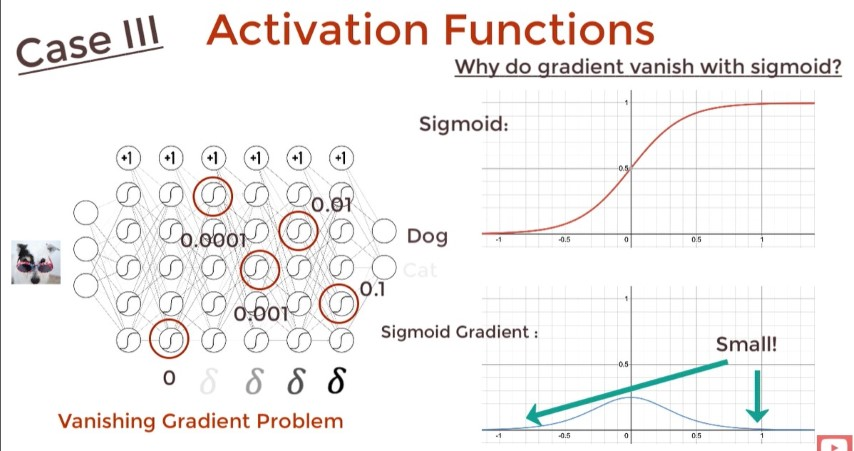
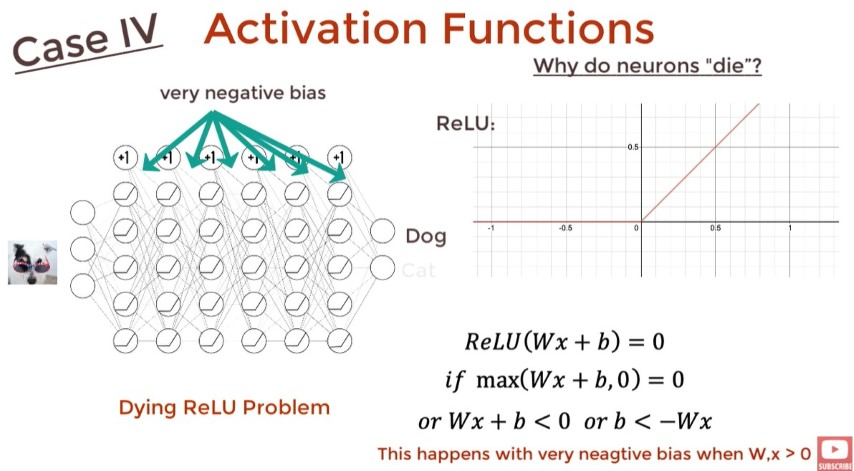

# ML

## Points

- `model.summery()` will print model structure > ex. FC | (NONE `is mini_batch`, 64).

## Convert Text to Number

```py
CATEGORIES = ["Dog", "Cat"]
class_num = CATEGORIES.index("Cat") #1
```

## Activation Function





- <https://youtu.be/s-V7gKrsels>
- Usually use softmax activiation function at the last layer which it will normalize the result for us.
- For Regression: Don't need activation funciton.
