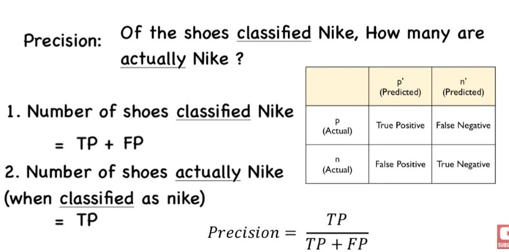
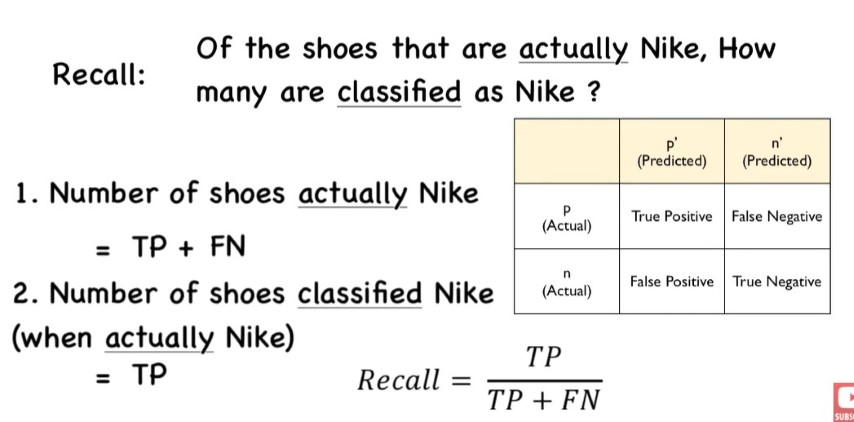
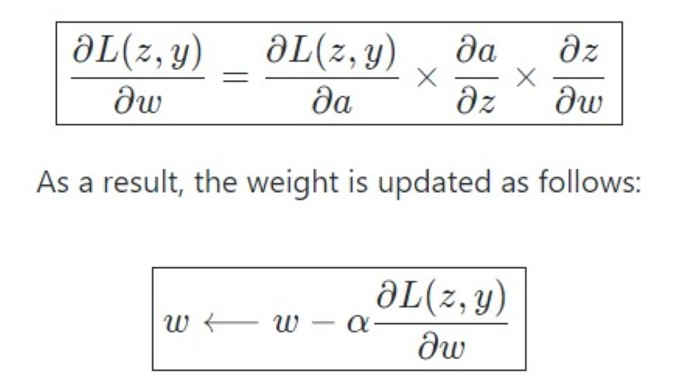
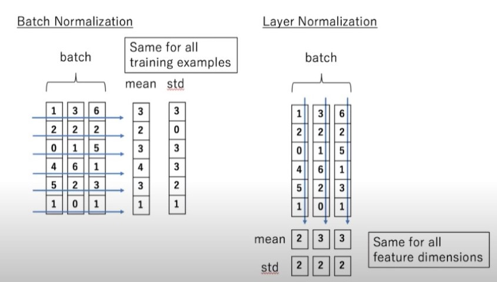
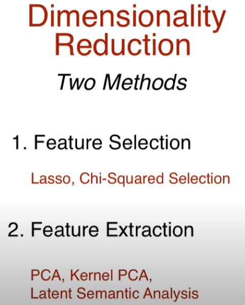

# ML

## Confusion Matrix

## Precision, Recall & F-Measure

<https://youtu.be/j-EB6RqqjGI>

## Loss Function

<https://youtu.be/QBbC3Cjsnjg>

In Regression

In Classification

There are more Loss functions, but we can use Adaptive Loss.

All losses have general equaltion, by using maximum likelihood estimation we will find our best Loss method.

## Optimzers

- <https://youtu.be/mdKjMPmcWj>
- Blog with more details <https://ruder.io/optimizing-gradient-descent/index.html#adagrad>

Gradient descent variants

- Batch gradient descent
- Stochastic gradient descent
- Mini-batch gradient descent

Gradient descent optimization algorithms

- Momentum
- Nesterov accelerated gradient
- Adagrad
- Adadelta
- RMSprop
- Adam
- AdaMax
- Nadam
- AMSGrad
- Other recent optim

## Learning rate

The learning rate, often noted α or sometimes η, indicates at which pace the weights get updated.

This can be fixed or adaptively changed. The current most popular method is called Adam, which is a method that adapts the learning rate.

## Backpropagation

Backpropagation is a method to update the weights in the neural network by taking into account the actual output and the desired output. The derivative with respect to weight w is computed using chain rule and is of the following form:

### Updating weights

In a neural network, weights are updated as follows:

- Step 1: Take a batch of training data.
- Step 2: Perform forward propagation to obtain the corresponding loss.
- Step 3: Backpropagate the loss to get the gradients.
- Step 4: Use the gradients to update the weights of the network.

## Dropout

Dropout is a technique meant to prevent overfitting the training data by dropping out units in a neural network. In practice, neurons are either dropped with probability p or kept with probability 1-p.

## Batch Normalization

Normalization on layer which will help our algorithm to fine min loss faster! (minus avg and divide it with variance) (Have trainable parameters)

Like Dropout, but does not replace it and we still use dropout for better results.

It is usually done after a fully connected/convolutional layer and before a non-linearity layer and aims at allowing higher learning rates and reducing the strong dependence on initialization.

### Layer Normalization

## PCA - Principal Component Analysis

<https://youtu.be/9oSkUej63y>

