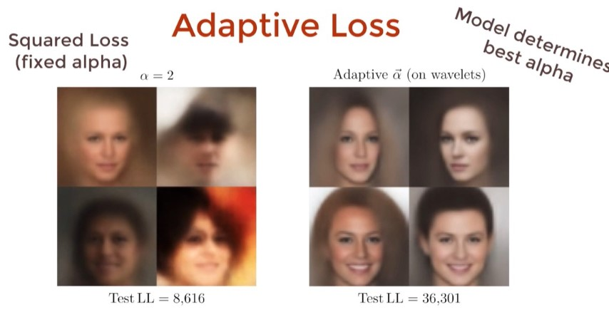

# ML

## OneHot Coding

## Confusion Matrix

## Precision, Recall & F-Measure

<https://youtu.be/j-EB6RqqjGI>

## Loss Function

<https://youtu.be/QBbC3Cjsnjg>

In Regression

In Classification

There are more Loss functions, but we can use Adaptive Loss.

All losses have general equaltion, by using maximum likelihood estimation we will find our best Loss method.

## overfitting / underfitting

- If validation loss >> training loss you can call it overfitting.
- If validation loss  > training loss you can call it some overfitting.
- If validation loss  < training loss you can call it some underfitting.
- If validation loss << training loss you can call it underfitting.

- Your aim is to make the validation loss as low as possible.
- Some overfitting is nearly always a good thing.
- All that matters in the end is: is the validation loss as low as you can get it.

## Optimzers

- <https://youtu.be/mdKjMPmcWj>
- Blog with more details <https://ruder.io/optimizing-gradient-descent/index.html#adagrad>

Gradient descent variants

- Batch gradient descent
- Stochastic gradient descent
- Mini-batch gradient descent

Gradient descent optimization algorithms

- Momentum
- Nesterov accelerated gradient
- Adagrad
- Adadelta
- RMSprop
- Adam
- AdaMax
- Nadam
- AMSGrad
- Other recent optim

## Learning rate

The learning rate, often noted α or sometimes η, indicates at which pace the weights get updated.

This can be fixed or adaptively changed. The current most popular method is called Adam, which is a method that adapts the learning rate.

## Backpropagation

Backpropagation is a method to update the weights in the neural network by taking into account the actual output and the desired output. The derivative with respect to weight w is computed using chain rule and is of the following form:

### Updating weights

In a neural network, weights are updated as follows:

- Step 1: Take a batch of training data.
- Step 2: Perform forward propagation to obtain the corresponding loss.
- Step 3: Backpropagate the loss to get the gradients.
- Step 4: Use the gradients to update the weights of the network.

## Dropout

Dropout is a technique meant to prevent overfitting the training data by dropping out units in a neural network. In practice, neurons are either dropped with probability p or kept with probability 1-p.

## Batch Normalization

Normalization on layer which will help our algorithm to fine min loss faster! (minus avg and divide it with variance) (Have trainable parameters)

Like Dropout, but does not replace it and we still use dropout for better results.

It is usually done after a fully connected/convolutional layer and before a non-linearity layer and aims at allowing higher learning rates and reducing the strong dependence on initialization.

### Layer Normalization

## PCA - Principal Component Analysis

<https://youtu.be/9oSkUej63y>

### Dimensionality Reduction

Two methods:

1. Feature Selection (Lasso, Chi-Squared Selection)
2. Feature Extraction (PCA, Kernel PCA, Latent Semantic Analysis)

## Gradient-boosting

Gradient-boosting is an ensemble learning method that takes an iterative approach to combining weak learners to create a strong learner by focusing on mistakes of prior iterations.

How is this really different than random forest? They are the same in that they're both ensemble methods based on decision trees, but there's a lot of differences as well. For instance, they're different in that gradient boosting uses a method called "boosting" while random forest used a method called "bagging". Both of these methods include sampling for each different tree that is built. The five second version of the difference between boosting and bagging is that bagging samples randomly, while boosting samples with an increased weight on the ones that it got wrong previously. Because all the trees in a random forest are built without any consideration for any of the other trees, this is incredibly easy to parallelize, which means that it can train really quickly. So if you have 100 trees, you could train them all at the same time. Whereas gradient boosting is iterative in that it relies on the results of the tree before it in order to apply a higher weight to the ones that the previous tree got incorrect. So boosting can't be parallelized and so it takes much longer to train. As you get into massive training sets, this becomes a serious consideration. Another difference is that the final predictions for random forest are typically an unweighted average or an unweighted voting, while boosting uses a weighted voting.

