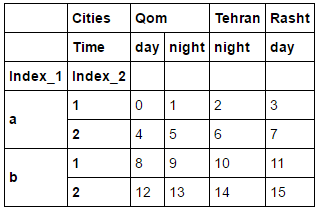
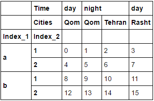
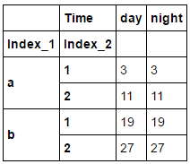
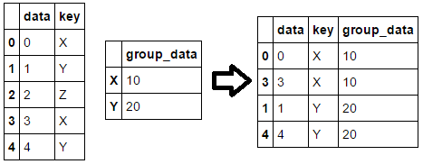
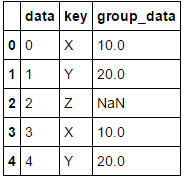
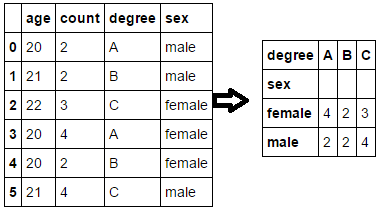
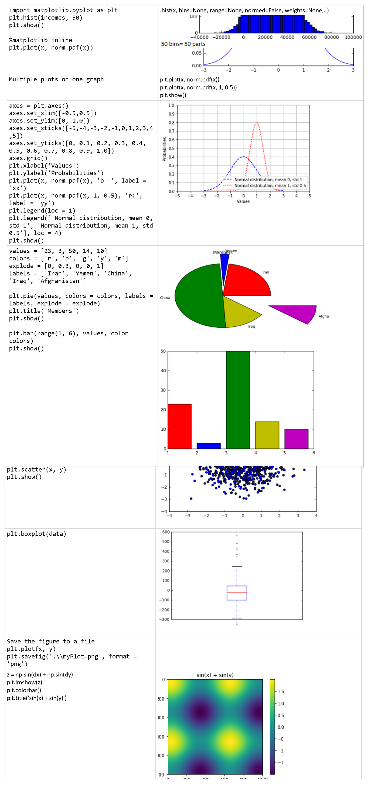

# ML, DL

* Facial Recongnition Database: https://www.kairos.com/blog/60-facial-recognition-databases
* Gensim (مانند LDA، LSI و یا Word2Vec) https://radimrehurek.com/gensim/
* https://keras.io/
* 100DaysOfMLCode: https://github.com/harshitahluwalia7895/100DaysOfMLCode
* Basic Concepts: https://github.com/yazdipour/notes/blob/master/assets/BasicConcepts.png
* WGet Kaggle Datasets in Google Driver:https://mh-salari.me/wqet-download/
* http://www.r2d3.us/visual-intro-to-machine-learning-part-1/
* https://github.com/xviniette/FlappyLearning
* https://deeplearnjs.org/
* https://community.cloud.databricks.com
* http://snap.stanford.edu/data/
* https://msropendata.com/
* https://www.deeplearning.ai/
* https://developers.google.com/machine-learning/crash-course/ml-intro
* http://playground.tensorflow.org
* https://www.ailab.microsoft.com/
* http://www.fast.ai/

## Online IDE/CodeEditors

* https://notebooks.azure.com
* https://codelabs.developers.google.com/

## DataSets

* Iran Open DataSets: https://virgool.io/@NimaShafiezadeh/فهرست-سایتهای-ایرانی-که-دادههای-باز-منتشر-میکنند-zenlqrfgddkt
* https://gallery.azure.ai/
* [[2 Million Politicians tweet Dataset](https://pastebin.com/1beXduu0)
* 25 Datasets for Deep Learning in 
IoT](https://hub.packtpub.com/25-datasets-deep-learning-iot/)
* https://msropendata.com/
* http://data.okfn.org/data
* https://datproject.org/
* https://toolbox.google.com/datasetsearch
* https://rajpurkar.github.io/SQuAD-explorer/
* https://www.datasetlist.com/
* https://www.visualdata.io/

## Book

* https://github.com/RatulGhosh/awesome-machine-learning
* https://m2dsupsdlclass.github.io/lectures-labs/
* http://incompleteideas.net/book/the-book-2nd.html
* How can machine learning solve my problem? http://mbmlbook.com/toc.html
* https://www.automl.org/book/

## Farsi References

* [ترجمه فارسی اصطلاحات داده کاوی و غیره](https://github.com/shervinea/cheatsheet-translation/tree/master/fa)
* https://dataio.ir/
* By https://twitter.com/afshinea
    * https://github.com/afshinea/stanford-cs-229-machine-learning
    * یاگیری با نظارت: https://stanford.io/2O7zuqn 
    * یادگیری بدون نظارت: https://stanford.io/2zU5TrI 
    * یادگیری عمیق: https://stanford.io/2Ryuaum 
    * نکات و ترفندهای یادگیری ماشین: https://stanford.io/2E08dS8
    * https://stanford.edu/~shervine/l/fa/teaching/cs-229/cheatsheet-supervised-learning
    * https://stanford.edu/~shervine/l/fa/teaching/cs-229/cheatsheet-unsupervised-learning
    * https://stanford.edu/~shervine/l/fa/teaching/cs-229/cheatsheet-deep-learning
    * https://stanford.edu/~shervine/l/fa/teaching/cs-229/cheatsheet-machine-learning-tips-and-tricks
    * https://stanford.edu/~shervine/l/fa/teaching/cs-230/cheatsheet-deep-learning-tips-and-tricks
    * https://stanford.edu/~shervine/l/fa/teaching/cs-230/cheatsheet-convolutional-neural-networks
    * https://stanford.edu/~shervine/l/fa/teaching/cs-230/cheatsheet-recurrent-neural-networks

## Tutorial

* https://ml-cheatsheet.readthedocs.io/en/latest/index.html
* https://lnkd.in/eJzXREq
* https://www.aparat.com/ma_keyvanrad
* https://aischool.microsoft.com/
* https://academy.microsoft.com/en-us/tracks/artificial-intelligence/
* [3D Visualization of a Convolutional Neural Network](http://scs.ryerson.ca/~aharley/vis/conv/)
* [GuiTeNet is a graphical user interface for (quantum) tensor networks](https://guitenet.github.io/)
* http://cs231n.github.io/
* https://lilianweng.github.io/lil-log/2018/02/19/a-long-peek-into-reinforcement-learning.html
* http://blog.class.vision/1397/04/اتصال-مستقیم-سرویس-کولب-google-colab-به-درایو-google-drive/
* [Introducing Wav2letter++](https://towardsdatascience.com/introducing-wav2latter-9e94ae13246)
* [Gans](http://blog.class.vision/1397/10/generative-adversarial-networks/)
* http://blog.class.vision/1397/11/chatbot-with-voice/
* http://onlinehub.stanford.edu/cs230
* http://deeplearning.ir/آموزش-شبکه-عصبی-بازگشتی-بخش-پنجم-معرفی/
* http://deeplearning.ir/آموزش-شبکه-های-عصبی-بازگشتی-recurrent-neural-networks-بخش-ا/
* http://deeplearning.ir/آموزش-شبکه-عصبی-بازگشتی-بخش-چهارم-معرف/
* http://deeplearning.ir/آموزش-شبکه-های-عصبی-بازگشتی-recurrent-neural-network-بخش-س/
* http://deeplearning.ir/آموزش-شبکه-های-عصبی-بازگشتی-recurrent-neural-networks-بخش-د

## Projects

* [Latest Deep Learning OCR with Keras and Supervisely in 15 minutes](https://hackernoon.com/latest-deep-learning-ocr-with-keras-and-supervisely-in-15-minutes-34aecd630ed8)
* [تشخیص پلاک فارسی خودرو](https://www.youtube.com/watch?v=Lb4IcGF5iTQ)
* http://winter96.class.vision/
* http://fall97.class.vision/
* [تشخیص تخلف در کارت های اعتباری](http://www.ai-man.ir/post/detecting-credit-card-fraud-using-machine-learning/)
* [آشنایی با چند مورد از رکامندر سیستم‌های اپن‌سورس](https://sokanacademy.com/blog/9043/آشنایی-با-چند-مورد-از-رکامندر-سیستم‌های-اپن‌سورس)
* [Liveness Detection with OpenCV](https://www.pyimagesearch.com/2019/03/11/liveness-detection-with-opencv/)
* [Traditional Face Detection With Python](https://realpython.com/traditional-face-detection-python/)
* https://www.pyimagesearch.com/2019/04/01/pan-tilt-face-tracking-with-a-raspberry-pi-and-opencv/
* http://blog.class.vision/1397/10/voice-style-transfer/
* http://blog.class.vision/1397/10/speech-emotion-recognition/
* http://blog.class.vision/1397/10/machine-translation/

## Books

Social Media Mining
http://dmml.asu.edu/smm/book/

Automate the Boring Stuff with Python
https://automatetheboringstuff.com/

Neural Networks and Deep Learning
http://neuralnetworksanddeeplearning.com/index.html

Natural Language Processing with Python
https://www.nltk.org/book/  

DATA SCIENCE HANDBOOK
https://www.thedatasciencehandbook.com/get-the-book#2

## Basic Consepts

| --- | --- |
| --- | --- |
| MLP | Mutli layer perseptron
| Ensemble learning | multi time trying and group of models votes for final result!
| Batch normalization | Normalization on layer which will help our algorithm to fine min loss faster! (minus avg and divide it with variance) (Have trainable parameters)
| Data Dividing | Train_Data 70%, Validation/Dev_Data 20%, Test_Data 10%
| Cross Validation | Split data in 10 parts, use one part as TestData and the rest for training, and then do the same process with another part. ***Not Usable for Deep learning [its expensive]***

## Confusion Matrix


## Recommender systems

* Content-based filtering : Consider properties of Object and content of it
* Collaborative filtering : Use users opinion
* Hybrid Recommender systems

## Discriminative

1. Regression
2. Logistic regression
3. decision tree (Hunt)
4. neural network(traditional network, deep network)  
5. Support Vector Machine(SVM)

## Generative

1. Hidden Markov model
2. Naive bayes
3. K-nearest neighbor(KNN)
4. Generative adversarial networks(GANs)

## ImageNet Models

* Classic: LeNet5, AlexNet, ZFNet, VGG(Nice structure, Bad Memory usage)
* Inception: (Idea: use  )
* ResNet

## Image Classification

A core task in Computer Vision

* Challenges: Illumination, Deformation, Occlusion, Background clutter, Intraclass variation
* Never use pure k-Nearest Neighbor on images. Cause: Distance metrics on level of whole images can be very unintuitive

# ML

## Naive Bayse

ex. Spam Mail Detector

## Gradient Descent

ex. Getting down from Mount. Height from ground. Goal is to get down easiest way. (Height is the error in Data Mining algorithms)

## Regression Linear

ex. Predict House prize based on other houses properties and prize -> Draw random line -> try minimize error using Gradient Descent (least square).

## Logistic Regression

ex. Divide two classes by a line -> random line til reduce sum of error with gradient descent (log lost method!)

## SVM (Support vector machine)

Like LR find the best divider. The line with maximum distance from the classes. -> Find maximum distance with Gradient Descent or other algothims!

## Kernel Method

Like LR when can't divide it in 2D. Add Z param so we can divide them with Surface in 3D.

```py
[A(0,3),B(1,2),B(2,1),A(3,0)] -> add Z=xy -> (x,y,xy)
Or in 2D divide with curve y=1/x
```

## K-Means Clustering

ex. Know numbers of clusters = K. find K centers for K groups

## Hierarchical Clustering

ex. Like K-Means instead of K numbers of clusters, group objects with maximum distance that we defind, so we have unknown numbers clusters.

## K-Nearest Classification

* PYTHON Predict  > `n = Knearest(); n.fit(x,y); n.predict(X)`
* PYTHON Validate > `n.score(xtest,ytest)*100`
* K is a hyper-parameter.

# Neural Networks

Divide classes auto with weird shapes. (Is above Line1->TRUE | Is above Line2->FALSE ::-> TRUE ....)

* Perceptron (The biological neuron)
    * Simple Perceptron can handle Linear problems.
    * MLP (Multi layer perseptron) can handle more.
    * PARTS
    * Input + BIAS (To avoid cases with ZERO inputs)
    * Output
    * Activation Function
    * Weights
* Neurons and Activation Functions
    * StepFunction: `z = wx + b (b for bias)` (Cons: Little changes doesn't have effect on final result)
    * Sigmoid (Curved Step fuction): `f(x)= 1/1+e^-x`  (Cons: In near infinity, Derivative is close to 0)
    * Hyperbolic Tangent: Tanh(z): `Tanh x=sinh x/cosh x` (Like Sigmoid Func)
    * ReLU: Rectified Linear Unit: `f(z)= max(0,z)`  `((z=0 in Negative Area and z=x in Positive Area))`
* Cost Functions
    * How bad is the model
    * y':=TrueValue, y=PredictedValue
    * `σ(z)=y < wx+b = z`
    * Simple Cost function: `C = Σ(y’-y)2 / n` (Cons: Slow Covergence)
    * Cross Entropy: `C = -Σ y’_i*log(y_i)` (Fast, Bigger Penalty on error changes)
        * This function helps to boost Learning Speed.
        * For `C` big, nueron learns faster.
        * ***If delta between TrainingLoss and TestLoss is alot, it is overftting***
* Gradient Descent
    * is a first-order iterative optimization algorithm for finding the minimum of ***the Cost function***.
    * To find a local minimum of a function using gradient descent, one takes steps proportional to the negative of the gradient of the function at the current point.
* Backpropagation
* DropOut: Killing random neuron on each epochs. / No Param to Learn

## Encoding / Representing class data

* One-hot encoding: Encode classes to Matrix of 1 and 0s.
    * Labels= ['shoe', 'shirt'] -> shirt == [0, 1]
    * Test=[0,1], Predict=[1,0]
    * Test2=[0,1], Predict2=[0,1]
    * -> (test*predict).sum() = 1 (1 wrong)


# Deep Learning

* When there is >=3 hidden layers in NN.
* Layers Count := | InputLayer + HiddenLayer |

1. CNN
2. RNN
3. LSTM
4. CapsuleNet
5. Siamese:
    * siamese cnn
    * siamese lstm
    * siamese bi-lstm
    * siamese CapsuleNet
6. Time series data

## CNN

Usually use ConvLayer at first layers, FC Layers for last ones and a softmax for last one.
* Fully Connected **FC**: NN with mesh connections between layers.
    * Why Not: Locality is not important in FC.
    * Why Not: Sometimes its imposible to compute all the connections.
* Pooling **POOL**: To make the input smaller but using Max/Min/Avg Pooling. With we make the input matrix in half. (No param to learn)
* Convolution **CONV**: Multipling different filters to the image.
    * Dense layers learn global patterns in their input feature space
    * Convolution layers learn local patterns
    * The patterns they learn are translation invariant
    * They can learn spatial hierarchies of patterns
    * ***Challenge***: After each multiple operation Centered Numbers in matrix have more effect on final result than cornered ones.
    * ***Solution***: Adding Padding (One Line Zero Padding)
    * Padding
        * Valid Convolution: Normal Convolution
        * Same Convolution: Convolution with add padding in each multiplation.
    * Stride: Number of Row*Columns to Skip on each multiplation.
    * Convolution Output: `[1+ (n+2p-f)/s] x [1+ (n+2p-f)/s]` ((nxn image, fxf filter, p padding, s stride)) (f,s are hyperparameter)
* One By One Conv:
    * It means use 1x1 filter.
    * 1x1 Filters aren't helpful for 1_Channeled images, but they can have different effect on each layer and overall different at the end.
* “sandwich” architecture (SCSCSC...)
    * simple cells: modifiable parameters
    * complex cells: perform pooling
* RGB Conv
    * Do `R*f1 + G*f2 + B*f3 + BIAS` will result in 3D Filter. and then sweep it on the RGB Matrix. This will result in 4x4 matrix. Then we can learn proper filter with repeating the process with different filters.


### Data Augmention

* Create new images from the original image, to train on.
* WAYS: Crop, Transition, Rotation, Flipping, Stretching, Shearing, Add Lens noise, ...

### Transfer learning

* Use pretrained model and only change output layer!
* Feature extraction: Use all the layers of the pretrained model, but replace your own FC layers at the end.
* Fine-tuning: Replace FCs and change couple of the layers of the pretrained model.

## Imbalanced Data

We can give weight to classes. Keras > `.fit(train_X,train_Y,class_weight = {0:3 , 1:1} )`

## Optimizers

```py
opt=keras.optimizers.Adam(lr=0.001, beta_1=0.9, beta_2=0.999, epsilon=1e-8, decay=1e-3/200)
# lr: float >= 0. > Learning Rate: The rate which we get closer to the min loss.
# decay. On each try, lr -= decay.
# epsilon: float >= 0. Fuzz factor.
```

## Regression NN

* Use LINEAR activation at the last layer, instead of softmax. (Unlinearity has handled in first layers!)
* Can't use CrossEntropy for cost function. We can use:
    * mean squared error: `Σ(y’-y)^2 / n`
    * mean absolute error `Σ|y’-y| / n`
    * mean absolute percentage `Σ|y’-y| / clip(y)-epsilon`! > If =200, it means, 200% or 2times have error.

## LSTM

* Sigmoid and Tahn activation function are useful in LSTM

## GANs

# Coding

## Keras

* https://github.com/yazdipour/SRU-deeplearning-workshop/
* np.squeeze > Remove single-dimensional entries from the shape of an array.
* model = Sequential() > Standard MLP Model
* model.add(Dense(64 `hyperparameter - hidden neuron` , activation='relu', input=25 `input params - only for first layer`))
* Usually add softmax at the last layer `model.add(Dense(activiation='softmax'))` / softmax will normalize the result for us.
* model.summery() > will print model structure > ex. FC | (NONE `is mini_batch`, 64)
* model.compile(loss=,optimizer=,metrics=,validation_split=0.2) 

### Symbolic and Imperative APIs

* Symbolic
    * Sequential Model: Build Layer by layer
    * Functional API: Multiple input type -> Multiple Output (House features and Images)
* Imperative
    * Model Sub classing: Inherit from Keras Classes and add custom features!

# ??

* Gensin Library
* Persian Stuff:
    * Hazm - NLP Preprocessor
    * Word2Vec-Doc2Vec
* ResNet50
* Xception
* Corpora:
    * Bijankhan
    * Persica
    * Hamshahri 1/2
    * Tnews

## Keras - Tensorflow

ذخیره #checkpoint در #keras در حین آموزش مدل

```py
filepath = "saved-model-{epoch:02d}-{val_acc:.2f}.hdf5"
checkpoint = keras.callbacks.ModelCheckpoint(filepath, monitor='val_acc', verbose=1, save_best_only=False, mode='max')
```

## Pandas

```py
import pandas as pd from pandas import Series, DataFrame from pandas import Series, DataFrame

Series (data=None, index=None, dtype=None, name=None, copy=False, fastpath=False)

obj.values
obj.index
ser1.sort_index()
ser1.sort_values()
rainDrop.to_dict()
Series(rainDrop_dict)
pd.isnull(obj) #Series of Booleans
pd.read_clipboard() #Paste from Clipboard
rainDrop.name = "Rain Drops of Cities"
rainDrop.index.name = "Cities"
.Round
.ix[3]
```

|||
|--- |--- |
|IN: 'Semnan' in rainDrop OUT: True|Is 'semnan' in raindrop indexes|
|.reindex(['A', 'B', 'D', 'Z'], fill_value = 0)||
|.reindex(range(11), method = 'ffill')  #forward filling|0    Tehran 3    Tabriz 6    Shiraz v----v-----v 0     Tehran 1     Tehran 2     Tehran 3     Tabriz 4     Tabriz 5     Tabriz|
|.reindex(range(11), method = 'bfill')|0     Tehran 1     Tabriz 2     Tabriz 3     Tabriz|
|.reindex(columns = ['col4', 'col1', 'col7'])|(Not renaming) new DF with those columns|
|.ix[['A', 'B', 'Z'], ['col1', 'col3', 'col8']]||
|.drop('A') .drop('col1', axis = 1)||
|.rank()|Base on value of item in series will return index of a sort one|
|dframe1.idxmin()|index of minimum value|
|.cumsum() .cumsum(axis = 1)|cumulative summation|
|.describe()|Min/max/std/mean… all together|
|data.isnull()|Return Boolean series|
|data.dropna()|Remove N/A (null)|
|dframe2.dropna(thresh=2)|keep the rows with at least 2 non-null values|
|dframe2.fillna({'A':0, 'B':1, 'C':2, 'D':3})|fill missing values of each column differently keys of the dictionary are columns and values are for filling missing values|
|dframe2.fillna(dframe2.mean())|fill missing value of each column by mean value of that column|
|Series(randn(6),  index = [[1, 1, 1, 2, 2, 2], ['a', 'b', 'c', 'a', 'b', 'c']])|Multi index|
|df= pd.read_table("testData.csv", sep=',', header = None, nrows = 2) df.columns = ["Age", "Toefl", "Degree", "UniRank"]|Open CSV (nrows only shows 2 row)|
|dframe.to_csv(sys.stdout, sep = "-", columns = ["Age", "Degree"])|Save CSV|
|import codecs dframe = pd.read_json(codecs.open('x.json', 'r', 'utf-8')) dframe.head(n = 1)|Open Json utf8|
|pd.io.html.read_html(url)|From Html|
|dframe1 = DataFrame({"key": list("XZYZXX"), "data_set_1": np.arange(6)})|Multi columns DF|
|arr1 = np.arange(9).reshape(3, 3) NUMPY.concatenate([arr1, arr1], axis = 0)|array([[0, 1, 2],[3, 4, 5],[6, 7, 8],        [0, 1, 2],[3, 4, 5],[6, 7, 8]])|
|np.concatenate([arr1, arr1], axis = 1)|array([[0, 1, 2, 0, 1, 2],        [3, 4, 5, 3, 4, 5],        [6, 7, 8, 6, 7, 8]])|
|pandas.concat([ser1, ser2]) pd.concat([dframe1, dframe2])|T    0 U    1|
|Series(np.where(pd.isnull(ser1), ser2, ser1), index = ser1.index)  ser1.combine_first(ser2)  np.where(pd.isnull(ser1), ser2, ser1)|make a series based on series1 while using series2 to replace its null values.|
|dframe_odds.combine_first(dframe_evens)|make a data frame based on dframe1 while using dframe2 to replace its null values.|
|dframe1.stack()/.unstack(level='city')  .stack(dropna=False)|Data Frame to Series #The null values will be ignored automatically|
|DataFrame.pivot(index=None, columns=None, values=None)|Reshape data based on column values|
|df2.pivot_table(index = 'sex', columns='degree')#, aggfunc=np.sum)|Use pivot_table if there are duplicates records|
|dframe.duplicated()|Series of Boolean if row contains duplicates|
|dframe.drop_duplicates(['key1'], keep='last')||
|state_map = {"Rasht": "Gilan", "Tehran": "Tehran", "Bam": "Kerman"} dframe['state'] = dframe['city'].map(state_map)|Add new a column to DF with Dict|
|ser1.replace([1,3], [100, 300])  ser1.replace({1:np.nan, 2:200})||
|dframe.index.map(str.upper)|def myMap(input):     return input + ",,," dframe.columns.map(myMap)|
|dframe.rename(index = str.title, columns = myMap, inplace=True)||
|decade_cats = pd.cut(years, myBins)|Return List of Categories which years are in it base on myBins|
|pd.cut(years, bins=2, labels=['First half', 'Second half'])|Split in to half|
|dframe.head(n=3)  dframe.tail()|Print part of a DF|
|blender = np.random.permutation(4)|Random Jaygasht of 0 To 4|
|Df.take(blender) arr.take(blender)|Shuffle DF or array base on blender permutation|
|group1 = dframe['dataset1'].groupby(dframe['k1'])|Return <pandas.core.groupby.SeriesGroupBy object>|
|arr1 = np.array(['Qom', 'Bam', 'Qom', 'Bam', 'Qom']) dframe['dataset1'].groupby(arr1).mean()|Dframe doesn’t have Bam and Qom but will assign them to 5 records of his and will make a group with Qom and Bam|
|||
|animals.ix[[1, 3], ['W', 'Y']] = np.nan||
|df['engExamResult']=df['engExamResult'].apply(pd.to_numeric, errors='coerce')|Casting|
|with pd.option_context('display.max_rows', None, 'display.max_columns', 3):     print(df) --------------- pd.set_option('display.max_rows', len(x)) print(x) pd.reset_option('display.max_rows')|(pretty) print the entire Pandas Series|
|df.ix[:, df.columns != 'b']|get all column except one|

## Numpy

|||
|--- |--- |
|`print("key1 = %s, key2 = %s" %(name[0], name[1]))`|PRINTING|
|The probability density function for norm is: تابع چگالی احتمال|`from scipy.stats import norm norm.pdf(x) = exp(-x**2/2)/sqrt(2*pi)`|
|Binomial Probability Mass Function احتمال دو جمله ای تابع جرم|`from scipy.stats import binom binom.pmf(k, n, p)= choose(n, k) * p**k * (1-p)**(n-k)`|
|from scipy.stats import norm mean, var, skew, kurt = norm.stats(moments='mvsk')||
|incomes = np.random.normal(27000, 15000, 10000)|#numpy.random.normal(loc=0.0, scale=1.0, size=None) #loc : Mean (“centre”) of the distribution #scale : Standard deviation (spread or “width”) of the distribution. #size: samples are drawn.|
|Np.Mean()/Median/std/var/sum()|In the calculation of the variance (of which the standard deviation is the square root) we typically divide by the number of values we have. But if we select a random sample of N elements from a larger distribution and calculate the variance, division by N can lead to an underestimate of the actual variance. To fix this, we can lower the number we divide by (the degrees of freedom) to a number less than N (usually N-1). The ddof parameter allows us change the divisor by the amount we specify. Unless told otherwise, NumPy will calculate the biased estimator for the variance (ddof=0, dividing by N). This is what you want if you are working with the entire distribution (and not a subset of values which have been randomly picked from a larger distribution). If the ddof parameter is given, NumPy divides by N - ddof instead.|
|incomes = np.append(incomes, 1000000000)||
|ages = np.random.randint(18, high = 90, size = 500) #(low, high=None, size=None, dtype='l') #Return random integers from low (inclusive) to high (exclusive)|array([25, 67, 43, 64, 59, 61, 71, 61, 44, 72, 65, 27, 43, 47, 72, 89, 19,        77, 43, 70, 68, 62, 55, 59, 33, 40, 36, 82, 83, 35, 25, 87, 36, 36,        32, 73, 21, 63, 47, 74, 38, 65, 63,…])|
|from scipy import stats stats.mode(ages)||
|import scipy.stats as sp sp.skew(values) sp.kurtosis(values)|Cheolegi|
|Percentile np.percentile(incomes, 50) Out[1]:500.53971145892342 np.median(incomes) Out[2]:500.53971145892342  (np.percentile(incomes, 84.3) - np.percentile(incomes, 15.7))/2 Out[36]:101.69168612853906|Char ak|
|import numpy as np x = np.random.randn(500)|#numpy.random.randn(d0, d1, ..., dn) # Return a sample (or samples) from the “standard normal” distribution. # Z : ndarray or float -- A (d0, d1, ..., dn)-shaped array of floating-point samples from the  #standard normal distribution, or a single such float if no parameters were supplied.|
|list1 = [1, 2, 3, 4]|List|
|array1 = np.array(list1)|Array (list + u can do math stuff on it)|
|myArray.shape|Returns (2L, 4L)|
|myArray.reshape(3,3)||
|myZeroArray = np.zeros([5,2]) .ones .eye .empty|Like matlab|
|np.arange(-7, 18, 3)|array([-7, -4, -1,  2,  5,  8, 11, 14, 17])|
|np.maximum(arr1, arr2)|array([-0.77586787,  1.05402537,  0.66089599,  0.03251308,  0.33092493])|
|np.sin(arr1)/.exp(arr)/.log/||
|import webbrowser webbrowser.open(url)|Open browser|
|arr arr[2:5] arr[-1:-4:-1] arr[:3] arr[-3::-2] arr[:3] = 100|array([ 0,  1,  2,  3,  4,  5,  6,  7,  8,  9, 10]) array([2, 3, 4]) array([10,  9,  8]) array([0, 1, 2]) array([8, 6, 4, 2, 0]) array([100, 100, 100, 3,  4,  5,  6,  7,  8,  9, 10])|
|arr_2d[:,:] = -1|array([[-1, -1, -1],        [-1, -1, -1]])|
|myArray.T/myArray.swapaxes(0, 1)/myArray3D.transpose(0, 2, 1)||
|np.dot(myArray, myArray.T)||
|Zip(a1,a2,a3) s=zip(s.index,s) res = [(val, idx) for idx, val in s.iteritems()]|#When you zip() together three lists containing 20 elements each, the result has  #twenty elements. Each element is a three-tuple.|
|arr1 = np.array([1, 2, 3, 4]) arr2 = np.array([100, 200, 300, 400]) condition = np.array([True, True, False, False]) answer2 = np.where(condition, arr1, arr2)|answer2 =array([  1,   2, 300, 400])|
|np.where(myArray < 0, 0, myArray)||
|booleanArray = myArray >= 0 booleanArray.all() booleanArray.any()|#all returns true if all entries are True #any returns true if at least one entry is True|
|myArray = np.array(["red", "blue", "yellow", "blue", "purple", "red"]) np.unique(myArray)|Only shows unique elements|
|np.in1d(["yellow", "red"], myArray)|array([ True,  True], dtype=bool) # if elements of first list or array are in the 1-dimensional array or not|
|np.save("myarray", arr) arr1 = np.load("myArray.npy")||
|np.savez("myZippedArrays", x = arr1, y = arr2) archivedArrays = np.load("myZippedArrays.npz") archivedArrays['x']||
|np.savetxt("myText2dArray.txt", arr_2d, delimiter = ',') arr_2d = np.loadtxt("myText2dArray.txt", delimiter = ',')|Save txt and csv|
|from numpy.random import randn randn(24).reshape(4, 6)||
|blender = np.random.permutation(4)||
|shaker = np.random.randint(0, 3, size=10)|Random array from 0,1,2|

```py
dframe2 = DataFrame(np.arange(16).reshape(4, 4)
    , index = [['a', 'a', 'b', 'b'], [1, 2, 1, 2]]
    , columns = [['Qom', 'Qom', 'Tehran', 'Rasht']
    , ['day', 'night', 'night', 'day']]) 
dframe2.index.names = ['Index_1', 'Index_2'] dframe2.columns.names = ['Cities', 'Time']
```



```py
|dframe2.swaplevel('Cities', 'Time', axis = 1)
```



```py
|dframe2.sum(level = 'Time', axis = 1)
```



```py
pd.merge(dframe1, dframe2)
pd.merge(dframe1, dframe2, on = ['key1', 'key2'], how = 'inner') /left/right/outer #Like JOIN in SQL must have same thing in a column
pd.merge(df_left, df_right, on = 'key1', suffixes= ['_lefty', '_righty']) #Add suffixes to end of columns which are not key1
```

```py
pd.merge(dframe_left, dframe_right, left_on = 'key', right_index = True)
```



```py
dframe_left.join(dframe_right, on='key')
```



```py
df1.pivot('sex', 'degree', 'count')
```



## Shallow Algorthims

Linear Regression

```py
from sklearn import linear_model
xtr,ytr=split_data(df)

lr=LinearRegression()
lr.fit(xtr,ytr)
ypre=lr.predict(xte)
```

Logistic Regression

```py
from sklearn.linear_model import LogisticReg
model=LogisticRegression()
model.fit(xtr,ytr)
accuracyTrain=model.score(xtr,ytr)
ypre=model.predict(xtest)
accuracy=metrics.accuracy_score(yte,ypre)
```

train_test_split

```py
xtr,ytr,xte,yte=train_test_split(x,target,test_size=0.3)
```

KNeighborsClassifier

```py
from sklearn.neighbors import KNeighborsClassifier
knn=KNeighborsCliassifier(n_neighbors)
knn.fit(xtr,ytr)
ypre=knn.predict(xtrain)
metrics.accuracy_score(ytr,ypre) #(TrainAcc going to be ==1)
metrics.accuracy_score(ytest,ypre) #(TestAcc is RIGHT)
```

## Plot

