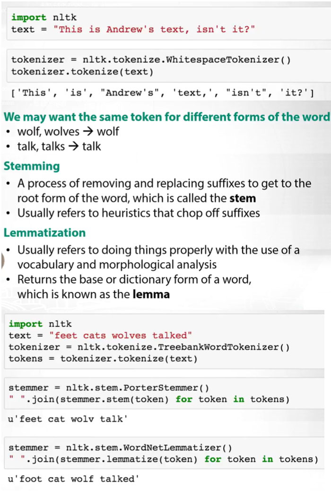
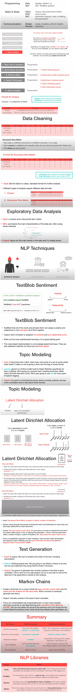

# NLP

## Text Encoding

1. (BPE) Byte Pair Enc
2. Word Piece Enc

## Summary of NLTK



## NLP NLTK

- Tokenizing - Splitting sentences and words from the body of text
- Corpus - Body of text, singular. Corpora is the plural of this. Example: A collection of medical journals.
- Lexicon - Words and their meanings. Example: English dictionary. Consider, however, that various fields will have different lexicons. For example: To a financial investor, the first meaning for the word &quot;Bull&quot; is someone who is confident about the market, as compared to the common English lexicon, where the first meaning for the word &quot;Bull&quot; is an animal. As such, there is a special lexicon for financial investors, doctors, children, mechanics, and so on.
- Token - Each &quot;entity&quot; that is a part of whatever was split up based on rules. For examples, each word is a token when a sentence is &quot;tokenized&quot; into words. Each sentence can also be a token, if you tokenized the sentences out of a paragraph.

_From [\_https://pythonprogramming.net/tokenizing-words-sentences-nltk-tutorial/_](https://pythonprogramming.net/tokenizing-words-sentences-nltk-tutorial/)

## Language modeling

Language modeling is the task of predicting the next word in a sentence, given all previous words. Language models have become a vital part of the NLP pipeline now, as they provide the backbone to various downstream tasks. Language models capture general aspects of the input text that is almost universally useful.

- ULMFiT
- ELMo
- XLNet

### Stopwords

```py
from nltk.corpus import stopwords
from nltk.tokenize import word_tokenize
example_sent = "This is a sample sentence, showing off the stop words filtration."
stop_words = set(stopwords.words('english'))
word_tokens = word_tokenize(example_sent)
filtered_sentence = [w for w in word_tokens if not w in stop_words]
```

_From [\_https://pythonprogramming.net/stop-words-nltk-tutorial/_](https://pythonprogramming.net/stop-words-nltk-tutorial/)

### Stemming

The idea of stemming is a sort of normalizing method.

One of the most popular stemming algorithms is the Porter stemmer, which has been around since 1979.

First, we&#39;re going to grab and define our stemmer:

```py
from nltk.stem import PorterStemmer
from nltk.tokenize import sent_tokenize, word_tokenize
ps = PorterStemmer()
#Now, let's choose some words with a similar stem, like:
example_words = ["python","pythoner","pythoning","pythoned","pythonly"]
#Next, we can easily stem by doing something like:
for w in example_words:
    print(ps.stem(w))
# Our output:----------
# python
# python
# python
# python
# pythonli
```

_From [\_https://pythonprogramming.net/stemming-nltk-tutorial/_](https://pythonprogramming.net/stemming-nltk-tutorial/)

### POS - Part of Speech Tagging

POS tag list:

```
CC	coordinating conjunction
CD	cardinal digit
DT	determiner
EX	existential there (like: "there is" ... think of it like "there exists")
FW	foreign word
IN	preposition/subordinating conjunction
JJ	adjective	'big'
JJR	adjective, comparative	'bigger'
JJS	adjective, superlative	'biggest'
LS	list marker	1)
MD	modal	could, will
NN	noun, singular 'desk'
NNS	noun plural	'desks'
NNP	proper noun, singular	'Harrison'
NNPS	proper noun, plural	'Americans'
PDT	predeterminer	'all the kids'
POS	possessive ending	parent\'s
PRP	personal pronoun	I, he, she
PRP$	possessive pronoun	my, his, hers
RB	adverb	very, silently,
RBR	adverb, comparative	better
RBS	adverb, superlative	best
RP	particle	give up
TO	to	go 'to' the store.
UH	interjection	errrrrrrrm
VB	verb, base form	take
VBD	verb, past tense	took
VBG	verb, gerund/present participle	taking
VBN	verb, past participle	taken
VBP	verb, sing. present, non-3d	take
VBZ	verb, 3rd person sing. present	takes
WDT	wh-determiner	which
WP	wh-pronoun	who, what
WP$	possessive wh-pronoun	whose
WRB	wh-abverb	where, when
```

```py
import nltk
from nltk.corpus import state_union
from nltk.tokenize import PunktSentenceTokenizer

custom_sent_tokenizer = PunktSentenceTokenizer(train_text)
tokenized = custom_sent_tokenizer.tokenize(sample_text)

def process_content():
    try:
        for i in tokenized[:5]:
            words = nltk.word_tokenize(i)
            tagged = nltk.pos_tag(words)
            print(tagged)
# Output: ---------------.
# [('PRESIDENT', 'NNP'), ('GEORGE', 'NNP'), ('W.', 'NNP'), ('BUSH', 'NNP'), ("'S", 'POS'), ('ADDRESS', 'NNP'), ('BEFORE', 'NNP'), ('A', 'NNP'), ('JOINT', 'NNP')……….
```

_From [\_https://pythonprogramming.net/part-of-speech-tagging-nltk-tutorial/_](https://pythonprogramming.net/part-of-speech-tagging-nltk-tutorial/)

### Chunking

In order to chunk, we combine the part of speech tags with [regular expressions](https://pythonprogramming.net/regular-expressions-regex-tutorial-python-3/).

```py
def process_content():
    try:
        for i in tokenized:
            words = nltk.word_tokenize(i)
            tagged = nltk.pos_tag(words)
            chunkGram = r"""Chunk: {<RB.?>*<VB.?>*<NNP>+<NN>?}"""
            chunkParser = nltk.RegexpParser(chunkGram)
            chunked = chunkParser.parse(tagged)
            chunked.draw()
```

- `<RB.?>*` = "0 or more of any tense of adverb,"
- `<VB.?>*` = "0 or more of any tense of verb,"
- `<NNP>+` = "One or more proper nouns,"
- `<NN>?` = "zero or one singular noun."


_From [\_https://pythonprogramming.net/chunking-nltk-tutorial/_](https://pythonprogramming.net/chunking-nltk-tutorial/)

### Chinking

Chinking is a lot like chunking, it is basically a way for you to remove a chunk from a chunk. The chunk that you remove from your chunk is your chink.

The code is very similar, you just denote the chink, after the chunk, with }{ instead of the chunk&#39;s {}.

```py
chunkGram = r"""Chunk: {<.*>+}
            }<VB.?|IN|DT|TO>+{"""
```

This means we&#39;re removing from the chink one or more verbs, prepositions, determiners, or the word &#39;to&#39;.

_From [\_https://pythonprogramming.net/chinking-nltk-tutorial/_](https://pythonprogramming.net/chinking-nltk-tutorial/)

### Named Entity Recognition

The idea is to have the machine immediately be able to pull out &quot;entities&quot; like people, places, things, locations, monetary figures, and more.

```py
tagged = nltk.pos_tag(words)
namedEnt = nltk.ne_chunk(tagged, binary=False)
```

Here are the types of Named Entities that you can get if you have binary as false:

NE Type and Examples

- ORGANIZATION - Georgia-Pacific Corp., WHO
- PERSON - Eddy Bonte, President Obama
- LOCATION - Murray River, Mount Everest
- DATE - June, 2008-06-29
- TIME - two fifty a m, 1:30 p.m.
- MONEY - 175 million Canadian Dollars, GBP 10.40
- PERCENT - twenty pct, 18.75 %
- FACILITY - Washington Monument, Stonehenge
- GPE - South East Asia, Midlothian

_From [\_https://pythonprogramming.net/named-entity-recognition-nltk-tutorial/?completed=/chinking-nltk-tutorial/_](https://pythonprogramming.net/named-entity-recognition-nltk-tutorial/?completed=/chinking-nltk-tutorial/)

#### Named Entity Recognition with Stanford NER Tagger (alternative to NLTK's NER)

A big benefit of the Stanford NER tagger is that is provides us with a few different models for pulling out named entities. We can use any of the following:

- 3 class model for recognizing locations, persons, and organizations
- 4 class model for recognizing locations, persons, organizations, and miscellaneous entities
- 7 class model for recognizing locations, persons, organizations, times, money, percents, and dates

```py
from nltk.tag import StanfordNERTagger
from nltk.tokenize import word_tokenize

st = StanfordNERTagger('/usr/share/stanford-ner/classifiers/english.all.3class.distsim.crf.ser.gz',
        '/usr/share/stanford-ner/stanford-ner.jar', encoding='utf-8')

text = 'While in France, Christine Lagarde discussed short-term stimulus efforts in a recent interview with the Wall Street Journal.'

tokenized_text = word_tokenize(text)
classified_text = st.tag(tokenized_text)

print(classified_text)

# ----------------
# [('While', 'O'), ('in', 'O'), ('France', 'LOCATION'), (',', 'O'), ('Christine', 'PERSON'), ('Lagarde', 'PERSON'), ('discussed', 'O'), ('short-term', 'O'), ('stimulus', 'O'), ('efforts', 'O'), ('in', 'O'), ('a', 'O'), ('recent', 'O'), ('interview', 'O'), ('with', 'O'), ('the', 'O'), ('Wall', 'ORGANIZATION'), ('Street', 'ORGANIZATION'), ('Journal', 'ORGANIZATION'), ('.', 'O')]
```

### Lemmatizing

A very similar operation to stemming is called lemmatizing. The major difference between these is, as you saw earlier, stemming can often create non-existent words, whereas lemmas are actual words.

```py
from nltk.stem import WordNetLemmatizer
lemmatizer = WordNetLemmatizer()
print(lemmatizer.lemmatize("cats"))
print(lemmatizer.lemmatize("cacti"))
```

The only major thing to note is that lemmatize takes a part of speech parameter, &quot;pos.&quot; If not supplied, the default is &quot;noun.&quot; This means that an attempt will be made to find the closest noun, which can create trouble for you. Keep this in mind if you use lemmatizing!

_From [\_https://pythonprogramming.net/lemmatizing-nltk-tutorial/?completed=/named-entity-recognition-nltk-tutorial/_](https://pythonprogramming.net/lemmatizing-nltk-tutorial/?completed=/named-entity-recognition-nltk-tutorial/)

### Corpora (dataset)

The NLTK corpus is a massive dump of all kinds of natural language data sets that are definitely worth taking a look at.

you will have your corpora file. The full path is something like: `C:\Users\yourname\AppData\Roaming\nltk_data\corpora`

```py
from nltk.corpus import gutenberg #gutenberg is bible dataset
sample = gutenberg.raw("bible-kjv.txt")
```

_From [\_https://pythonprogramming.net/nltk-corpus-corpora-tutorial/?completed=/lemmatizing-nltk-tutorial/_](https://pythonprogramming.net/nltk-corpus-corpora-tutorial/?completed=/lemmatizing-nltk-tutorial/)

### Wordnet

[WordNet](https://wordnet.princeton.edu/) is a lexical database for the English language, which was created by Princeton, and is part of the NLTK corpus.

You can use WordNet alongside the NLTK module to find the meanings of words, synonyms, antonyms, and more. Let&#39;s cover some examples.

```py
from nltk.corpus import wordnet
syns = wordnet.synsets("program")

print(syns[0].name())
plan.n.01

Just the word:
print(syns[0].lemmas()[0].name())
Plan

Definition of that first synset:
print(syns[0].definition())
a series of steps to be carried out or goals to be accomplished

Examples of the word in use:
print(syns[0].examples())
['they drew up a six-step plan', 'they discussed plans for a new bond issue']


for syn in wordnet.synsets("good"):
    for l in syn.lemmas():
        synonyms.append(l.name())
        if l.antonyms():
            antonyms.append(l.antonyms()[0].name())
print(set(synonyms))
print(set(antonyms))
```

Use WordNet to compare the similarity of two words and their tenses, by incorporating the [Wu and Palmer method](http://search.cpan.org/~tpederse/WordNet-Similarity-1.03/lib/WordNet/Similarity/wup.pm) for semantic related-ness.

Let&#39;s compare the noun of &quot;ship&quot; and &quot;boat:&quot;

```py
w1 = wordnet.synset(&#39;ship.n.01&#39;)
w2 = wordnet.synset(&#39;boat.n.01&#39;)
print(w1.wup_similarity(w2))
0.9090909090909091
```

_From [\_https://pythonprogramming.net/wordnet-nltk-tutorial/?completed=/nltk-corpus-corpora-tutorial/_](https://pythonprogramming.net/wordnet-nltk-tutorial/?completed=/nltk-corpus-corpora-tutorial/)

### Text Classification

```py
import nltk
import random
from nltk.corpus import movie_reviews
documents = [(list(movie_reviews.words(fileid)), category)
             for category in movie_reviews.categories()
             for fileid in movie_reviews.fileids(category)]
random.shuffle(documents)
print(documents[1])
all_words = []
for w in movie_reviews.words():
    all_words.append(w.lower())
all_words = nltk.FreqDist(all_words) //nr of times words used in the text
print(all_words.most_common(15))
#the most popular "words" are actually things like punctuation, "the," "a" and so on
print(all_words["stupid"])
```

_From [\_https://pythonprogramming.net/text-classification-nltk-tutorial/?completed=/wordnet-nltk-tutorial/_](https://pythonprogramming.net/text-classification-nltk-tutorial/?completed=/wordnet-nltk-tutorial/)

### Converting words to Features

```py
def find_features(document):
    words = set(document)
    features = {}
    for w in word_features:
        features[w] = (w in words)
    return features
featuresets = [(find_features(rev), category) for (rev, category) in documents]
```

_From [\_https://pythonprogramming.net/words-as-features-nltk-tutorial/?completed=/text-classification-nltk-tutorial/_](https://pythonprogramming.net/words-as-features-nltk-tutorial/?completed=/text-classification-nltk-tutorial/)

### Naive Bayes Classifier


```py
# set that we'll train our classifier with
training_set = featuresets[:1900]
# set that we'll test against.
testing_set = featuresets[1900:]

classifier = nltk.NaiveBayesClassifier.train(training_set)

print("Classifier accuracy percent:",(nltk.classify.accuracy(classifier, testing_set))*100)

classifier.show_most_informative_features(15)
```

_From [\_https://pythonprogramming.net/naive-bayes-classifier-nltk-tutorial/?completed=/words-as-features-nltk-tutorial/_](https://pythonprogramming.net/naive-bayes-classifier-nltk-tutorial/?completed=/words-as-features-nltk-tutorial/)

### Saving results in pickle

```py
save_classifier = open("naivebayes.pickle","wb")
pickle.dump(classifier, save_classifier)
save_classifier.close()


classifier_f = open("naivebayes.pickle", "rb")
classifier = pickle.load(classifier_f)
classifier_f.close()
```

_From [\_https://pythonprogramming.net/pickle-classifier-save-nltk-tutorial/?completed=/naive-bayes-classifier-nltk-tutorial/_](https://pythonprogramming.net/pickle-classifier-save-nltk-tutorial/?completed=/naive-bayes-classifier-nltk-tutorial/)

### Scikit-Learn Sklearn with NLTK

```py
from nltk.classify.scikitlearn import SklearnClassifier
MNB_classifier = SklearnClassifier(MultinomialNB())
MNB_classifier.train(training_set)
print("MultinomialNB accuracy percent:",nltk.classify.accuracy(MNB_classifier, testing_set))

from sklearn.naive_bayes import MultinomialNB,BernoulliNB
BNB_classifier = SklearnClassifier(BernoulliNB())
BNB_classifier.train(training_set)
print("BernoulliNB accuracy percent:",nltk.classify.accuracy(BNB_classifier, testing_set))

from sklearn.linear_model import LogisticRegression,SGDClassifier
from sklearn.svm import SVC, LinearSVC, NuSVC
//same…
```

_From [\_https://pythonprogramming.net/sklearn-scikit-learn-nltk-tutorial/?completed=/pickle-classifier-save-nltk-tutorial/_](https://pythonprogramming.net/sklearn-scikit-learn-nltk-tutorial/?completed=/pickle-classifier-save-nltk-tutorial/)

### Combining Algorithms with NLTK

From <https://pythonprogramming.net/combine-classifier-algorithms-nltk-tutorial/?completed=/sklearn-scikit-learn-nltk-tutorial>

## BLEU Score

BLEU (bilingual evaluation understudy) is an algorithm for evaluating the quality of text which has been machine-translated from one natural language to another.

BLEU’s strength is that it correlates well with human judgment by averaging out individual sentence judgment errors over a test corpus, rather than attempting to devise the exact human judgment for every sentence.

## Overall Tutorial

- [Youtube](https://www.youtube.com/channel/UCyv-PL-QgkAXEfDRcKrYMeA/videos)
- [Github Repo](https://github.com/adashofdata/nlp-in-python-tutorial)


