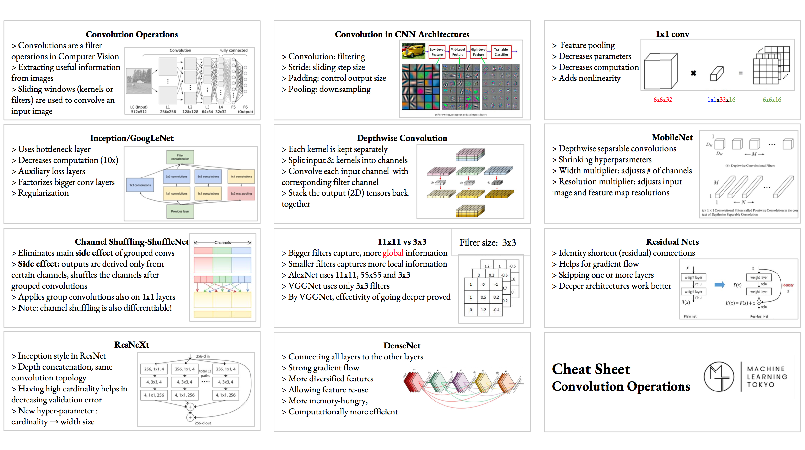

# Neural Networks

Divide classes auto with weird shapes. (Is above Line1->TRUE | Is above Line2->FALSE ::-> TRUE ....)

- Perceptron (The biological neuron)
  - Simple Perceptron can handle Linear problems.
  - MLP (Multi layer perseptron) can handle more.
  - PARTS
  - Input + BIAS (To avoid cases with ZERO inputs)
  - Output
  - Activation Function
  - Weights
- Neurons and Activation Functions
  - StepFunction: `z = wx + b (b for bias)` (Cons: Little changes doesn't have effect on final result)
  - Sigmoid (Curved Step fuction): `f(x)= 1/1+e^-x` (Cons: In near infinity, Derivative is close to 0)
  - Hyperbolic Tangent: Tanh(z): `Tanh x=sinh x/cosh x` (Like Sigmoid Func)
  - ReLU: Rectified Linear Unit: `f(z)= max(0,z)` `((z=0 in Negative Area and z=x in Positive Area))`
- Cost Functions
  - How bad is the model
  - y':=TrueValue, y=PredictedValue
  - `σ(z)=y < wx+b = z`
  - Simple Cost function: `C = Σ(y’-y)2 / n` (Cons: Slow Covergence)
  - Cross Entropy: `C = -Σ y’_i*log(y_i)` (Fast, Bigger Penalty on error changes)
    - This function helps to boost Learning Speed.
    - For `C` big, nueron learns faster.
    - **_If delta between TrainingLoss and TestLoss is alot, it is overftting_**
- Gradient Descent
  - is a first-order iterative optimization algorithm for finding the minimum of **_the Cost function_**.
  - To find a local minimum of a function using gradient descent, one takes steps proportional to the negative of the gradient of the function at the current point.
- Backpropagation
- DropOut: Killing random neuron on each epochs. / No Param to Learn

## Encoding / Representing class data

- One-hot encoding: Encode classes to Matrix of 1 and 0s.
  - Labels= ['shoe', 'shirt'] -> shirt == [0, 1]
  - Test=[0,1], Predict=[1,0]
  - Test2=[0,1], Predict2=[0,1]
  - -> (test\*predict).sum() = 1 (1 wrong)

## Convolution Operation



## CNN

Usually use ConvLayer at first layers, FC Layers for last ones and a softmax for last one.

- Fully Connected **FC**: NN with mesh connections between layers.
  - Why Not: Locality is not important in FC.
  - Why Not: Sometimes its imposible to compute all the connections.
- Pooling **POOL**: To make the input smaller but using Max/Min/Avg Pooling. With we make the input matrix in half. (No param to learn)
- Convolution **CONV**: Multipling different filters to the image.
  - Dense layers learn global patterns in their input feature space
  - Convolution layers learn local patterns
  - The patterns they learn are translation invariant
  - They can learn spatial hierarchies of patterns
  - **_Challenge_**: After each multiple operation Centered Numbers in matrix have more effect on final result than cornered ones.
  - **_Solution_**: Adding Padding (One Line Zero Padding)
  - Padding
    - Valid Convolution: Normal Convolution
    - Same Convolution: Convolution with add padding in each multiplation.
  - Stride: Number of Row\*Columns to Skip on each multiplation.
  - Convolution Output: `[1+ (n+2p-f)/s] x [1+ (n+2p-f)/s]` ((nxn image, fxf filter, p padding, s stride)) (f,s are hyperparameter)
- One By One Conv:
  - It means use 1x1 filter.
  - 1x1 Filters aren't helpful for 1_Channeled images, but they can have different effect on each layer and overall different at the end.
- “sandwich” architecture (SCSCSC...)
  - simple cells: modifiable parameters
  - complex cells: perform pooling
- RGB Conv
  - Do `R*f1 + G*f2 + B*f3 + BIAS` will result in 3D Filter. and then sweep it on the RGB Matrix. This will result in 4x4 matrix. Then we can learn proper filter with repeating the process with different filters.

### Data Augmention

- Create new images from the original image, to train on.
- WAYS: Crop, Transition, Rotation, Flipping, Stretching, Shearing, Add Lens noise, ...

### Transfer learning

- Use pretrained model and only change output layer!
- Feature extraction: Use all the layers of the pretrained model, but replace your own FC layers at the end.
- Fine-tuning: Replace FCs and change couple of the layers of the pretrained model.

## Imbalanced Data

We can give weight to classes. Keras > `.fit(train_X,train_Y,class_weight = {0:3 , 1:1} )`

## Optimizers

```py
opt=keras.optimizers.Adam(lr=0.001, beta_1=0.9, beta_2=0.999, epsilon=1e-8, decay=1e-3/200)
# lr: float >= 0. > Learning Rate: The rate which we get closer to the min loss.
# decay. On each try, lr -= decay.
# epsilon: float >= 0. Fuzz factor.
```

## Regression NN

- Use LINEAR activation at the last layer, instead of softmax. (Unlinearity has handled in first layers!)
- Can't use CrossEntropy for cost function. We can use:
  - mean squared error: `Σ(y’-y)^2 / n`
  - mean absolute error `Σ|y’-y| / n`
  - mean absolute percentage `Σ|y’-y| / clip(y)-epsilon`! > If =200, it means, 200% or 2times have error.

### Symbolic and Imperative APIs

- Symbolic
  - Sequential Model: Build Layer by layer
  - Functional API: Multiple input type -> Multiple Output (House features and Images)
- Imperative
  - Model Sub classing: Inherit from Keras Classes and add custom features!
