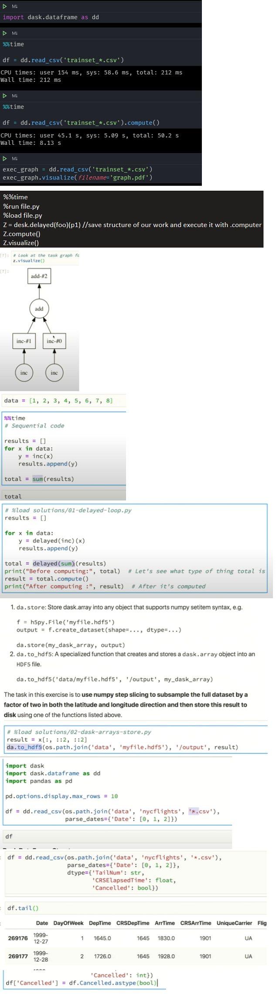

# Parallelized Pre/Processing

## Dask

- Blogs
  - <https://towardsdatascience.com/how-i-learned-to-love-parallelized-applies-with-python-pandas-dask-and-numba-f06b0b367138>
  - <https://towardsdatascience.com/are-you-still-using-pandas-for-big-data-12788018ba1a>
- [Youtube Tutorial](https://www.youtube.com/watch?v=mqdglv9GnM8)
- [Github Repo](https://github.com/TomAugspurger/dask-tutorial-pycon-2018)
- <https://dask.org>
- <https://github.com/dask/dask-examples>
- <https://github.com/dask/dask-tutorial>

