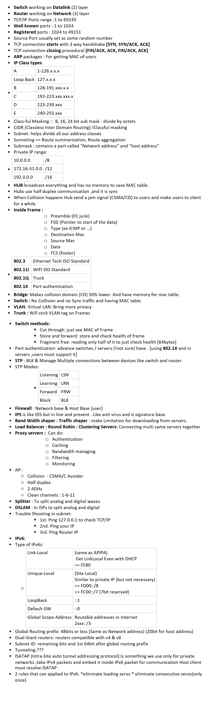

# Network

## Wire & Cable

|                 |                                                                         |
| --------------- | ----------------------------------------------------------------------- |
| RS-232 to USB : | Converter for Serial Ports                                              |
| RJ45:           | [Net] 8 pin Cables (good for star topologie)(best cable=50micron cover) |
| RJ45 coupler :  | to make connection longer                                               |
| RG11:           | [Tel] 4 or 6 pin [CAT1]                                                 |
| Fiber optic:    | SMF or MMF [100km]                                                      |
| Coaxial cable:  | TV [185m-500m]                                                          |
| OTDR            | Optical Time Domain Reflectometer -Finding Broken place in fiber optic  |
| Wire crimper    | Finding cut place in wires                                              |
| Punchdown       | For connecting patch panels                                             |

## Commands

|                 |            |                                                        |                                                                                                                            |
| --------------- | ---------- | ------------------------------------------------------ | -------------------------------------------------------------------------------------------------------------------------- |
| Windows Windows | Unix       | Describe                                               | Syntax                                                                                                                     |
| Ping            |            | Sending ICMP packages                                  | [-t  UNLIMITTED][-l changing size of icmps (default 32byte)][-i setting TTL TimeToLeave/NumMaxSteps]                       |
| Netstat         |            | PC connections                                         | -abno O  for PID B for Process Name N for not translating A showing ports                                                  |
| Tracert         | Traceroute | Show routers on way to that IP                         | [x.x.x.x IP][-4 -6 using ipvx]                                                                                             |
| Getmac          |            | Getting my MAC                                         | [-v SHOW BETTER]                                                                                                           |
| Arp             |            | Show & modify Mac of IPs                               | [-a SHOW ALL][-s ip mac set static mac][-d DELETE]                                                                         |
| Ipconfig        |            | Get & Set IP and DNS                                   | [/renew GET NEW dhcp IP][/release delete dhcp ip] [/display SHOW DNS TABLE][/flushdns delete dns table] /all  more details |
| Pathping        | Mtr        | Ping + Tracert                                         |                                                                                                                            |
|                 | Arpping    | Ping to mac address                                    |                                                                                                                            |
| Nbtstat         |            | Show Mac + PC names in Network                         | [-a]                                                                                                                       |
| Nslookup        | Dig        | (DNS) IP of Name Server                                | [www.x.com]                                                                                                                |
|                 | Host       | Reverse DNS                                            |                                                                                                                            |
| Route           |            | Add / Show routing table                               | [print TO SHOW][sample : add 157.0.0.0 mask 255.0.0.0 157.55.80.1] /? Get help                                             |
| Ftp             |            | Using FTP                                              | [put TO UPLOAD][get to download]                                                                                           |
| Netsh           |            |                                                        | Interface  ipv4 wlan show profiles wlan delete profiles name=Cisco                                                         |
| Nslookup        |            |                                                        |                                                                                                                            |
| Sigverif        |            | Signed Device Drivers Sys32>DriverStore>FileRepository |                                                                                                                            |
| Pnputil         |            | Plug & play                                            |                                                                                                                            |
|                 |            |                                                        |                                                                                                                            |

## Dictionary

|                  |                                                                                                                                                       |
| ---------------- | ----------------------------------------------------------------------------------------------------------------------------------------------------- |
| APIPA            | Auto Private IP Addressing                                                                                                                            |
| NAT              | Network Address Translation [local IP to public IP in AP]                                                                                             |
| Monitor Splitter | Use to broadcast one monitor in multi monitors                                                                                                        |
| RAS              | ( Remote Access Service ) به سروری گفته می شود که تعداد زیادی Modem به آن متصل بوده و کاربران می توانند به آن Connect کرده و از اینترنت استفاده کنند. |
| DNS              | Domain name system                                                                                                                                    |
| MAC              | Media access control                                                                                                                                  |
| QOS              | Quality of services                                                                                                                                   |
| Loop Back IP     | 127.0.0.1                                                                                                                                             |
| PAN              | Personal Area Network                                                                                                                                 |
| LAN              | Local AN                                                                                                                                              |
| CAN              | Campus AN                                                                                                                                             |
| MAN              | Metropolitan AN                                                                                                                                       |
| WAN              | Wide AN                                                                                                                                               |
| VPN              | Virtual private network                                                                                                                               |
| UTP              | Un shield twisted pair [ radius 100m]                                                                                                                 |
| STP              | Shield twisted pair                                                                                                                                   |
| SMF              | Single mode fiber [ radius 100km]                                                                                                                     |
| MMF              | Multi mode fiber                                                                                                                                      |
| STP              | Spanning tree protocol [BLK & Manage Multiple connections between devices][ether channel]                                                             |
| IPS              | Intrusion prevention systems                                                                                                                          |
| IDS              | Intrusion detection systems                                                                                                                           |
| NTP              | Network time protocol                                                                                                                                 |
| SCP              | Secure Copy protocol                                                                                                                                  |
| LDAP             | Lightweight directory access protocol                                                                                                                 |
| SNMP             | Simple network management protocol                                                                                                                    |
| NOC              | Network operation center [place to monitor activities]                                                                                                |
| PSTN             | Public switch telephone name [kind of a WAN[                                                                                                          |
| ADSL             | Asymmetric DSL                                                                                                                                        |
| SDSL             | Symmetric DSL [Upload=Download]                                                                                                                       |
| ICMP             | Internet Control Message Protocol                                                                                                                     |
| IGMP             | Internet Group Management Protocol                                                                                                                    |

## Layers

[OSI](https://www.cloudflare.com/learning/ddos/glossary/open-systems-interconnection-model-osi/)

|              |     |                                              |
| ------------ | --- | -------------------------------------------- |
| App          | 7   | User application + Port                      |
| Presentation | 6   | Encrypt & Format & Compressing & Translating |
| Session      | 5   | Check if it received                         |
| Transport    | 4   | TCP/UDP                                      |
| Network      | 3   | IP [ICMP,IGMP,ARP]                           |
| Data Link    | 2   | MAC                                          |
| Physical     | 1   | NIC                                          |

TCP

|           |     |         |                  |
| --------- | --- | ------- | ---------------- |
| App       | 5   | PDU     |                  |
| Transport | 4   | Segment | TCP Header       |
| Network   | 3   | Package | IP Header        |
| Data Link | 2   | Frame   | MAC / LLC Header |
| Physical  | 1   | Bits    |                  |

[src1 (overall)](https://www.studytonight.com/computer-networks/tcp-ip-reference-model) // [src2 (details)](http://www.pearsonitcertification.com/articles/article.aspx?p=1804869)

## Ports

https://en.wikipedia.org/wiki/List_of_TCP_and_UDP_port_numbers

|          |           |                    |
| -------- | --------- | ------------------ |
| 0        | IP        |                    |
| 1        | ICMP      |                    |
| 6        | TCP       |                    |
| 20       | Ftp       |                    |
| 21       | Ftp       |                    |
| 22       | SSH       |                    |
| 23       | Telnet    |                    |
| 25       | Smtp      | Mail               |
| 41,43,44 | IPv6      |                    |
| 53       | DNS       |                    |
| 67       | DHCP      | For PxE boot       |
| 69       | TFtp      |                    |
| 80       | Http      |                    |
| 110      | Pop3      |                    |
| 161\162  | SNMP      | Network monitoring |
| 443      | Https/SSL |                    |
| 3389     | RDP       |                    |

## network-plus

