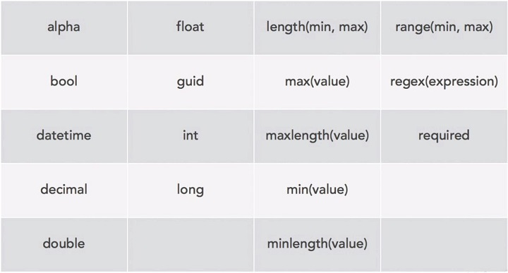

# ASP

## Startup

```cs
// Startup()
private readonly IConfigurationRoot configuration;
configuration = new ConfigurationBuilder()
                    .AddEnvironmentVariables()
                    .AddJsonFile(env.ContentRootPath + "/config.json")
                    .AddJsonFile(env.ContentRootPath + "/config.development.json", true)
                    .Build();


// ConfigureServices()
services.AddMvc();
class FeatureToggles{bool EnableDeveloperExceptions = false;}
services.AddTransient<FeatureToggles>(x => new FeatureToggles { EnableDeveloperExceptions = configuration.GetValue<bool>("FeatureToggles:EnableDeveloperExceptions")});
// {"FeatureToggles": {"EnableDeveloperExceptions": true}}
if(configuration["FeatureToggles:EnableDeveloperExceptions"]=="True"){}


// Configure(+1 FeatureToggles)
app.UseExceptionHandler("/error.html"); // 404 for users
if(features.EnableDeveloperExceptions) app.UseDeveloperExceptionPage();
app.Use(async (context, next) =>
{
    if (context.Request.Path.Value.Contains("invalid")) throw new Exception("ERROR!");
    await next(); // Continues Configure()!!
});
app.UseFileServer(); //use wwwroot
```

## Routes

```cs
app.UseMvc(routes =>
    routes.MapRoute("Default","{controller=Home}/{action=Index}/{id?}"));
// {controller = defaultControl}
// {action = Index}
// {id:int?} Optional Integer
```



## DI

* Transient: Shortest lifespan - An insstance will be created everytime one is requested.
* Scoped: A single instance will be created for each "scope". In ASP, the "scope" is almost always the current web request.
* Singleton: A single instance will be created for the entire application.

## MVC

ViewPage is dynamic typed. Its like a Dictionary.

### Controller

```cs
[Route("blog")]
public class BlogController : Controller{
    //GET: /blog/ - When defining Route[""], /blog/index will not work.
    [Route("")]
    public IActionResult Index(){
        var posts = new[]{new Post{},new Post{}};
        return View(posts);
        // return new ContentResult{Content="RawHtml"};
    }
    //GET: /blog/Post/2000/12/key
    [Route("{year:min(2000)}/{month:range(1,12)}/{key}")]
    public IActionResult Post(int year, int? month, string key)
    {
        if(month==null){}
        var post = new Post { Title = "My blog post", ...};
        return View(post);
    }
```

### View

```html
<!-- // Views/Blog/Index.cshtml -->
@model IEnumerable<Models.Post>
@{
    Layout = "_Layout";
}
<h1>Explorer's Blog</h1>
<p>
    Below are a few of the latest posts from some of our explorers.
</p>
<div class="blog-posts">
    @foreach (var post in Model)
        @Html.Partial("_Post", post)
</div>

<!-- // Views/Blog/Post.cshtml -->
@model Models.Post
@{
    Layout = "_Layout";
}
@Html.Partial("_Post")

<!-- // Views/Shared/_Post.cshtml -->
@inject Models.FormattingService Format
@model Models.Post
@section header { <!-- IsSectionDefined Checks this -->
    <h1>Explore our world your way</h1>
    <a href="/tours.htm" title="Find your tour!"><h2>Find your tour</h2></a>
}
<article class="blog-post">
    <h1>@Model.Title</h1>
    <div class="details">
        Posted <span>@Format.AsReadableDate(Model.Posted)</span> by <span>@Model.Author</span>
    </div>
    <div class="content">
        @Model.Body
    </div>
</article>

<!-- // Views/Shared/_Layout.cshtml -->
<!DOCTYPE HTML>
<html lang="en">
    ...
    <a href="@Url.Action("Index", "Blog")" title="read our blog!">Read our Blog</a>
<section id="actionCall">
      @if (IsSectionDefined("header"))
        @RenderSection("header", false)
      else
          <h1>Explore our world your way</h1>
  </section>
  <div id="contentWrapper">
  <section id="mainContent"> @RenderBody() </section>
    <aside id="secondaryContent">
        <div id="specials" class="callOut">
            @await (Component.InvokeAsync<ViewComponents.MonthlySpecialsViewComponent>())
        </div>
    </aside>
  </div>
  <footer id="pageFooter"> Copyright Me @DateTime.Now.Year </footer>
</html>
```

## Razor

With Razor


Without Razor


### @{ code } Multi-line Statements


### @( code ) Multi-Token Statements


### Layout/Master Page Scenarios

#### Layout Page

`Layout.cshtml`


#### Master Page

`Home.cshtml`

`@{LayoutPage = "Layout.cshtml";}`


### HTML Helpers


## Form

### Build Form

```html
<form request="post">
    <input asp-for="email"></label> 
    <!-- asp-for put this attr in Model.email -->
```

OR

```cs
@using (Html.BeginForm())
{
    @Html.Label("Name: ")
    @Html.TextBoxFor(m=>m.Id) <br/>
    <button type="submit" value="submit">Submit</button>
}
```

### Reciveing

```cs
var email2 = Request.Form["email"];
//OR
[BindProperty]
public string email { get; set; }  

public async Task<IActionResult> OnPost()
{
    Foo(email);
    return Redirect("/");
}
```

## Query

```cs
// root/?page=1
if(Request.QueryString.HasValue
    && Request.QueryString.Value.Contains("page="))
    string pageInString = Request.Query["page"];
```
