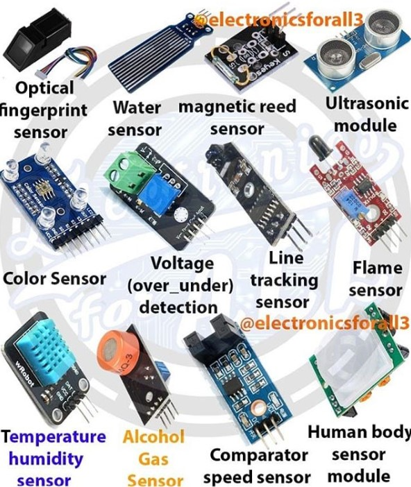
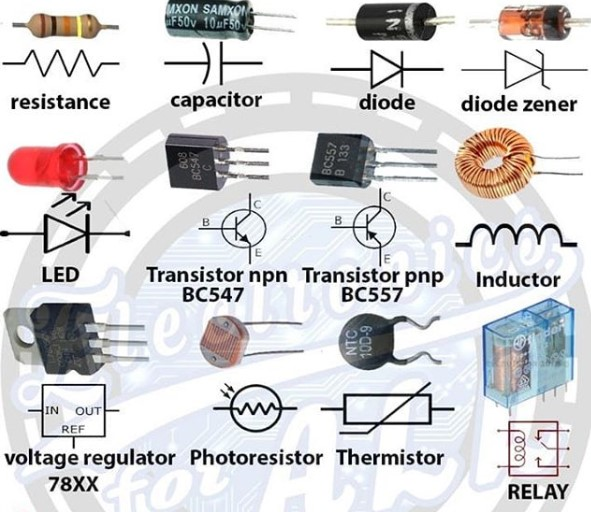

# IOT

## Resources

- http://marchisformakers.com/
- https://www.hackster.io/ThothLoki/play-video-with-python-and-gpio-a30c7a

## Shops

- http://yazdkit.com/

## Tools

- https://azure-samples.github.io/raspberry-pi-web-simulator/
- [Fritzing](http://fritzing.org/home/) is an open-source hardware initiative that makes electronics accessible as a creative material for anyone

## RPi

* [A server for the Raspberry Pi with access to the digital GPIO pins via RESTful JSON and Socket.io](https://github.com/projectweekend/Pi-GPIO-Server)

## Sensors




### Ultrasonic


```cpp
const int anPin = 0;
long anVolt, cm;

void setup() {
   Serial.begin(9600);
}

void loop() {  
   anVolt = analogRead(anPin);
   cm = anVolt/2;
   delay(100);
}
```

or

```cpp
long readUltrasonicDistance(int triggerPin, int echoPin) // ex (7,7)
{
  pinMode(triggerPin, OUTPUT);  // Clear the trigger
  digitalWrite(triggerPin, LOW);
  delayMicroseconds(2);
  // Sets the trigger pin to HIGH state for 10 microseconds
  digitalWrite(triggerPin, HIGH);
  delayMicroseconds(10);
  digitalWrite(triggerPin, LOW);
  pinMode(echoPin, INPUT);
  // Reads the echo pin, and returns the sound wave travel time in microseconds
  return pulseIn(echoPin, HIGH);
}
```

### Photoresistor


### Servo motor


```cpp
#include <Servo.h>
int servoPin = 9;
int angle = 0;   // servo position in degrees
Servo servo;  
void setup() {servo.attach(servoPin);}
void loop() {
    // scan from 0 to 180 degrees
    for(angle = 0; angle < 180; angle++){
        servo.write(angle);
        delay(15);
    }
    // now scan back from 180 to 0 degrees
    for(angle = 180; angle > 0; angle--){
        servo.write(angle);
        delay(15);
    }
}
```

### Potentiometers

A potentiometer is a three-terminal resistor with a sliding or rotating contact that forms an adjustable voltage divider. 


### LCD


```cpp
//  http://www.arduino.cc/en/Tutorial/LiquidCrystal
#include <LiquidCrystal.h>
// initialize the library with the numbers of the interface pins
LiquidCrystal lcd(12, 11, 5, 4, 3, 2);
void setup() {
  // set up the LCD's number of columns and rows:
  lcd.begin(16, 2);
  // Print a message to the LCD.
  lcd.print("hello, world!");
}
void loop() {
  // set the cursor to column 0, line 1
  // (note: line 1 is the second row, since counting begins with 0):
  lcd.setCursor(0, 1);
  // print the number of seconds since reset:
  lcd.print(millis() / 1000);
}
```

## MQTT

```sh
sudo apt-get install mosquitto
sudo apt-get install mosquitto-clients

mosquitto -p 1883 //to start -d as daemon
sudo service mosquitto start //to start as a service
//The stop/start scripts start the mosquitto broker in the background and also use the default mosquitto.conf file in the /etc/mosquitto/ folder.

mosquitto_pub -t mytopic -m {\”status\”:\”off\”} -h 192.168.0.104
// -d debug option to see sending process
// -u username and -P password flags
// -q 1 QOS flag

mosquitto_sub -t mytopic
```
