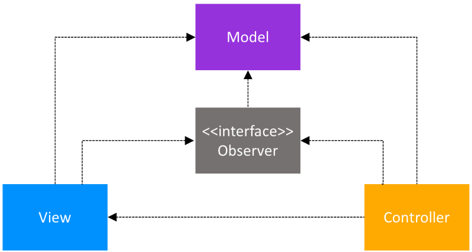
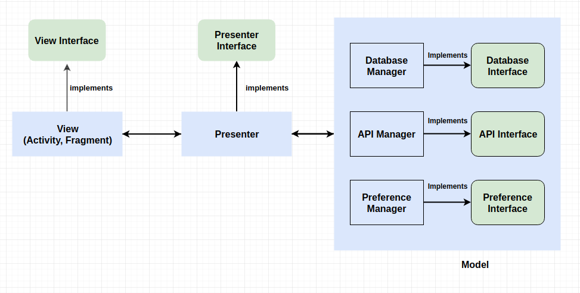

# Architecture / Compound Patterns

* Android MVC, MVP, and MVVM: https://academy.realm.io/posts/eric-maxwell-mvc-mvp-and-mvvm-on-android/
* MVVM Example: https://medium.com/@husayn.hakeem/android-by-example-mvvm-data-binding-introduction-part-1-6a7a5f388bf7

## MVC

* Combines Strategy, Observer and Composite patterns

* Model — the data layer, responsible for managing the business logic and handling network or database API.
* View — the UI layer — a visualisation of the data from the Model.
* Controller — the logic layer, gets notified of the user’s behavior and updates the Model as needed.

Two types of MVC:

### Passive Model


### Active Model

For the cases when the Controller is not the only class that modifies the Model, the Model needs a way to notify the View, and other classes, about updates. This is achieved with the help of the Observer pattern. The Model contains a collection of observers that are interested in updates. The View implements the observer interface and registers as an observer to the Model.



## MVC - Android

* The Activities, Fragments and Views should be the Views
* The Controllers should be separate classes that don’t extend or use any Android class, and same for the Models.
* One problem arises when connecting the Controller to the View, since the Controller needs to tell the View to update. In the **passive Model** MVC architecture, the Controller needs to hold a reference to the View. The easiest way of doing this, while focusing on testing, is to have a BaseView interface, that the Activity/Fragment/View would extend. So, the Controller would have a reference to the BaseView.

## MVC - Web

```c
#http://x.com/users/profile/1
/routes
    users/profile/:id = Users.getProfile(id)
/controllers
    class Users{
        function getProfile(id){
            profile = this.UserModel.getProfile(id)
            renderView('users/profile', profile)
/models
    class UserModel{
        function getProfile(id){
            return this.db.get('SELECT * FROM users WHERE id='+id);
/views
    /users
        /profile
            <h1>{{profile.name}}</h1>
```

## MVP



* Model - the data layer. Responsible for handling the business logic and communication with the network and database layers.
* View - the UI layer. Displays the data and notifies the Presenter about user actions.
* Presenter - retrieves the data from the Model, applies the UI logic and manages the state of the View, decides what to display and reacts to user input notifications from the View.

## MVP - Android

* Model: The retrieval of tasks is done with the help of RxJava:

```java
public Observable<List<Task>> getTasks(){  ...
```

* ModelTest: The Model receives as parameters in the constructor interfaces of the local and remote data sources, making the Model completely independent from any Android classes and thus easy to unit test with JUnit

```java
@Mock
private TasksDataSource mTasksRemoteDataSource;
@Mock
private TasksDataSource mTasksLocalDataSource;
...
@Test
public void getTasks_requestsAllTasksFromLocalDataSource() {
    // Given that the local data source has data available
    setTasksAvailable(mTasksLocalDataSource, TASKS);
    // And the remote data source does not have any data available
    setTasksNotAvailable(mTasksRemoteDataSource);
    // When tasks are requested from the tasks repository
    TestSubscriber<List<Task>> testSubscriber = new TestSubscriber<>();
    mTasksRepository.getTasks().subscribe(testSubscriber);
    // Then tasks are loaded from the local data source
    verify(mTasksLocalDataSource).getTasks();
    testSubscriber.assertValue(TASKS);
}
```

* View: The View works with the Presenter to display the data and it notifies the Presenter about the user’s actions. All Views implement the same BaseView interface that allows setting a Presenter.

```java
public interface BaseView<T> {
    void setPresenter(T presenter);
```

The View notifies the Presenter that it is ready to be updated by calling the subscribe method of the Presenter in onResume. The View calls presenter.unsubscribe() in onPause to tell the Presenter that it is no longer interested in being updated. If the implementation of the View is an Android custom view, then the subscribe and unsubscribe methods have to be called on onAttachedToWindow and onDetachedFromWindow. User actions, like button clicks, will trigger corresponding methods in the Presenter, this being the one that decides what should happen next.

The Views are tested with Espresso. The statistics screen, for example, needs to display the number of active and completed tasks. The test that checks that this is done correctly first puts some tasks in the TaskRepository; then launches the StatisticsActivity and checks content of the views:

```java
@Before
public void setup() {
    // Given some tasks
    TasksRepository.destroyInstance();
    TasksRepository repository = Injection.provideTasksRepository(
            InstrumentationRegistry.getContext());
    repository.saveTask(new Task("Title1", "", false));
    repository.saveTask(new Task("Title2", "", true));
    // Lazily start the Activity from the ActivityTestRule
    Intent startIntent = new Intent();
    mStatisticsActivityTestRule.launchActivity(startIntent);
}
@Test
public void Tasks_ShowsNonEmptyMessage() throws Exception {
    // Check that the active and completed tasks text is displayed
    Context context = InstrumentationRegistry.getTargetContext();
    String expectedActiveTaskText = context
        .getString(R.string.statistics_active_tasks);
    onView(withText(containsString(expectedActiveTaskText)))
        .check(matches(isDisplayed()));
}
```

* Presenter: The Presenter and its corresponding View are created by the Activity. References to the View and to the TaskRepository - the Model - are given to the constructor of the Presenter. In the implementation of the constructor, the Presenter will call the setPresenter method of the View. This can be simplified when using a dependency injection framework that allows the injection of the Presenters in the corresponding views, reducing the coupling of the classes.

All Presenters implement the same BasePresenter interface.

```java
public interface BasePresenter {
    void subscribe();
    void unsubscribe(); // The role of the unsubscribe method is to clear all the subscriptions of the Presenter, thus avoiding memory leaks.
```

When the subscribe method is called, the Presenter starts requesting the data from the Model, then it applies the UI logic to the received data and sets it to the View. For example, in the StatisticsPresenter, all tasks are requested from the TaskRepository - then the retrieved tasks are used to compute the number of active and completed tasks. These numbers will be used as parameters for the showStatistics(int numberOfActiveTasks, int numberOfCompletedTasks) method of the View.

A unit test to check that indeed the showStatistics method is called with the correct values is easy to implement. We are mocking the TaskRepository and the StatisticsContract.View and give the mocked objects as parameters to the constructor of a StatisticsPresenter object. The test implementation is:

```java
@Test
public void loadNonEmptyTasksFromRepository_CallViewToDisplay() {
    // Given an initialized StatisticsPresenter with 1 active and 2 completed tasks
    setTasksAvailable(TASKS);
    // When loading of Tasks is requested
    mStatisticsPresenter.subscribe();
    // Then the correct data is passed on to the view
    verify(mStatisticsView).showStatistics(1, 2);
}
```

## MVVM

* The View - that informs the ViewModel about the user’s actions
* The ViewModel - exposes streams of data relevant to the View
* The DataModel - abstracts the data source. The ViewModel works with the DataModel to get and save the data.


## MVVM - Android

* DataModel: The DataModel exposes data easily consumable through event streams - RxJava’s Observables + hold the entire business logic.

* ViewModel: The ViewModel retrieves the necessary data from the DataModel, applies the UI logic and then exposes relevant data for the View to consume. Similar to the DataModel, the ViewModel exposes the data via Observables.

* View: It can be an Activity, a Fragment or any custom Android View. For Activities and Fragments.

We are binding and unbinding from the event sources on `onResume() and onPause()`.

```java
    private final CompositeSubscription mSubscription = new CompositeSubscription();
    @Override
    public void onResume() {
        super.onResume();
        mSubscription.add(mViewModel.getSomeData()
                         .observeOn(AndroidSchedulers.mainThread())
                         .subscribe(this::updateView,this::handleError));
    @Override
    public void onPause() {
        mSubscription.clear();
        super.onPause();
```

If the MVVM View is a **custom Android View**, the binding is done in the constructor. To ensure that the subscription is not preserved, leading to possible memory leaks, the unbinding happens in onDetachedFromWindow.

```java
    private final CompositeSubscription mSubscription = new CompositeSubscription();
    public MyView(Context context, MyViewModel viewModel) {
        ...
        mSubscription.add(mViewModel.getSomeData()
                         .observeOn(AndroidSchedulers.mainThread())
                         .subscribe(this::updateView,this::handleError));
    @Override
    public void onDetachedFromWindow() {
        mSubscription.clear();
        super.onDetachedFromWindow();
```

* Testability: Consider the following example where the ViewModel just exposes some data from the DataModel:

```java
public class ViewModel {
    private final IDataModel mDataModel;

    public ViewModel(IDataModel dataModel) {
        mDataModel = dataModel;
    }

    public Observable<Data> getSomeData() {
        return mDataModel.getSomeData();
    }
}
```

The tests for the ViewModel are easy to implement. With the help of Mockito, we are mocking the DataModel and we control the returned data for the methods used. Then, we make sure that when we subscribe to the Observable returned by getSomeData(), the expected data is emitted.

```java
public class ViewModelTest {
    @Mock
    private IDataModel mDataModel;
    private ViewModel mViewModel;

    @Before
    public void setUp() throws Exception {
        MockitoAnnotations.initMocks(this);
        mViewModel = new ViewModel(mDataModel);
    }

    @Test
    public void testGetSomeData_emitsCorrectData() {
        SomeData data = new SomeData();
        Mockito.when(mDataModel.getSomeData()).thenReturn(Observable.just(data));
        TestSubscriber<SomeData> testSubscriber = new TestSubscriber<>();
        mViewModel.getSomeData().subscribe(testSubscriber);
        testSubscriber.assertValue(data);
```

**If the ViewModel needs access to Android classes, we create wrappers that we call Providers. For example, for Android resources we created a IResourceProvider, that exposes methods like `String getString(@StringRes final int id)`. The implementation of the IResourceProvider will contain a reference to the Context but, the ViewModel will only refer to an IResourceProvider injected.**

### Example

https://academy.realm.io/posts/eric-maxwell-mvc-mvp-and-mvvm-on-android/


```java
public class TicTacToeViewModel implements ViewModel {

    private Board model;

    /* 
     * These are observable variables that the viewModel will update as appropriate
     * The view components are bound directly to these objects and react to changes
     * immediately, without the ViewModel needing to tell it to do so. They don't
     * have to be public, they could be private with a public getter method too.
     */
    public final ObservableArrayMap<String, String> cells = new ObservableArrayMap<>();
    public final ObservableField<String> winner = new ObservableField<>();

    public TicTacToeViewModel() {
        model = new Board();
    }

    /* An Action, callable by the view */
    public void onClickedCellAt(int row, int col) {
        cells.put("" + row + col, playerThatMoved == null ? null : model.mark(row, col).toString());
        winner.set(model.getWinner() == null ? null : model.getWinner().toString());
    }

    /* An Action, callable by the view */
    public void onResetSelected() {
        model.restart();
        winner.set(null);
        cells.clear();
    }
}
```

```xml
<layout xmlns:android="http://schemas.android.com/apk/res/android"
    xmlns:tools="http://schemas.android.com/tools"
    xmlns:app="http://schemas.android.com/apk/res-auto">
    <data>
        <import type="android.view.View" />
        <variable name="viewModel" type="com.acme.tictactoe.viewmodel.TicTacToeViewModel" />
    </data>
    <LinearLayout...>
        <Button
            android:onClick="@{() ->viewModel.onClickedCellAt(0,0)}"
            android:text='@{viewModel.cells["00"]}' />
        <LinearLayout...
            android:visibility="@{viewModel.winner != null ? View.VISIBLE : View.GONE}"
            tools:visibility="visible"> **use tools for XmlDesigner**
            <TextView
                android:text="@{viewModel.winner}"
                tools:text="X" /> **use tools for XmlDesigner**
```