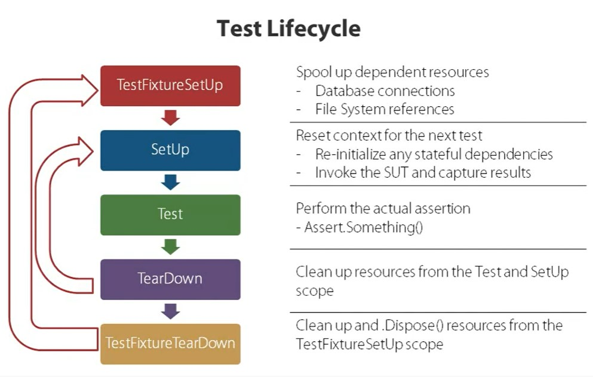
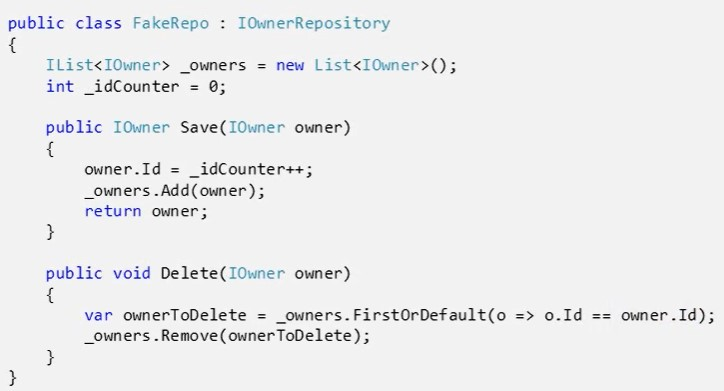
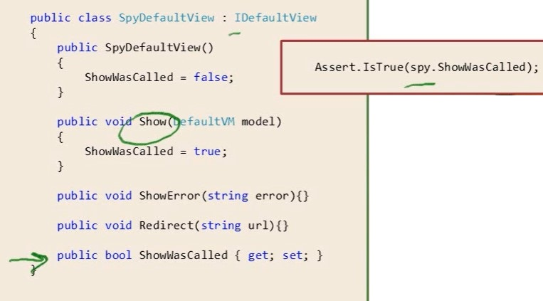

# Unit Test

Unit tests are low-level tests that focus on testing a specific part of our system. They are cheap to write and fast to run. Test failures should provide enough contextual information to pinpoint the source of the error. These tests are typically written by developers during the Implementation phase of the Software Development Life Cycle (SDLC).

Unit tests should be independent and isolated; interacting with external components increases both the scope of our tests and the time it takes for tests to run. As we will see in a future post, replacing dependencies with test doubles results in deterministic tests that are quick to run.

## Process

1. Write Failing Test
2. Code to make it pass
3. Refactor Code

## Unit Test Example

```py
def find_top_word(words)
    # Return most common word & occurrences
    word_counter = Counter(words)
    return word_counter.most_common(1)[0]

def test_find_top_word():
    words = ["foo", "bar", "bat", "baz", "foo", "baz", "foo"]
    result = find_top_word(words)

    assert result[0] == "foo"
    assert result[1] == 3
```

## Test Structure

### AAA

- _Arrange_: The data used in a test should not depend on the environment in which the test is running. All the data needed for a test should be arranged as part of the test.
- _Act_: Invoke the actual method under test.
- _Assert_: A test method should test for a single logical outcome, implying that typically there
  should be only a single logical assert. A logical assert could have multiple physical asserts as
  long as all the asserts test the state of a single object. In a few cases, an action can update
  multiple objects.

### Given-When-Then (GWT)

GWT is widely used in Behavior Driven Development (BDD).

GWT provides a useful abstraction for separating the different phases of our test:

- Given a set of pre-conditions
- When we perform an action on the SUT
- Then our post-conditions should be as follows

```py
def test_find_top_word():
    # Given a list of word
    words = ["foo", "bar", "bat", "baz", "foo", "baz", "foo"]

    # When we run the function over the list
    result = find_top_word(words)

    # Then we should see `foo` occurring 3 times
    assert result[0] == "foo"
    assert result[1] == 3
```

## F.I.R.S.T Principles

### FAST

A developer should not hesitate to run the tests as they are slow.

### ISOLATED/INDEPENDENT

A test method should do the 3 As => Arrange, Act, Assert

### REPEATABLE

A test method should NOT depend on any data in the environment/instance in which it is running.
Deterministic results - should yield the same results every time and at every location where they run.
No dependency on date/time or random functions output.
Each test should setup or arrange it's own data.
What if a set of tests need some common data? Use Data Helper classes that can setup this data for re-usability.### SELF-VALIDATING

No manual inspection required to check whether the test has passed or failed.

### THOROUGH/TIMELY

- Should cover every use case scenario and NOT just aim for 100% coverage.
- Tests for corner/edge/boundary values.
- Tests for large data sets - this will test runtime and space complexity.
- Tests for security with users having different roles - behavior may be different based on user's role.
- Tests for large values - overflow and underflow errors for data types like integer.
- Tests for exceptions and errors.
- Tests for illegal arguments or bad inputs.

## Naming Conventions

```java
<ObjectName>TriggerTest
<ClassName>ControllerTest
<ClassName>Test
test<methodUnderTest>_<shortUseCaseScenarioName>_<ExpectedResult>
eg: testTheFuncName_scenario_expexctedOutCome()
```

## MSTest

```c#
[TestClass]
class x{
    [ClassInitialize]
    public void static BarClass(TestContext tc){} // This method executes before any of test methods in class - ONLY ONCE

    [ClassCleanup]
    public void static BazClass(){} // This method executes after test last method in class - ONLY ONCE

    [TestInitialize]
    void Bar(){} // This method executes before each method

    [TestCleanUp]
    void Baz(){} // This method executes after each method

    [TestMethod]
    void Foo(){}
```

## NUnit

1. Install NUnit Nuget
2. Install NUnit Test Adapter Nuget (Help VS to Understand NUnit)

```c#
[Category("Class X")]
// [TestFixture] //default
[TestFixture(7,"hello")] //test with this inputs
[TestFixture(28,"bye")] //multiple input
class x_test{

    public x_test(int input1, string input2){
        //do sth
    }

    [SetupTest] //public void Init(){}
    public void SetupTest(){ //func name is not important
        //do things u want to do at the 1st of each test method
    }

    [TearDown] public void Dispose()
    { /*  that method will be called after each test method in the derived class */ }

    [Test]
    [ExpectedException(typeof(ArgumentNullException))] // can't use typeof(Exception) if our exception is exactly ArgumentNullException
    void Foo([Values(1,3,2)] int arg){

        var output = X.PlusOne(arg);
        Assert.AreEqual(arg+1, output);

        StringAssert.Contains("x", "helox");

        foreach (IEnumerable<X> x in xs)
            CollectionAssert.AllItemsAreNotNull(x);
    }
}
```

## Test LifeCycle



## Test doubles

Mocks, Stubs, Spies, Dummies and Fakes are types of test doubles that will help you to accomplish the goal of isolation. There are several libraries that provide tools to easily create these objects in your tests. Sinon.js is a javascript library that provides standalone test spies, stubs and mocks with no dependencies that work with any unit testing framework.

### Dummies

```js
var taskManager = new TaskManager();

taskManager.addTask(new DummyTask());
taskManager.addTask(new DummyTask());

assert.equal(taskManager.tasksCount(), 2);
```

### Stubs

Basic Impl of Interfaces to Up and run Tests with minimum implementation.

```cs
public class StubRepo IOwnerRepository {
    public IOwner FindByld(int id){}
    public IOwner Save(IOwner owner) => new Owner();
    public void Delete(IOwner owner){}
}
```

### Fakes

The simplest way to think of a Fake is as a step up from a Stub. This means not only does it return values, but it also works just as a real Collaborator would.



### Spies

Add spies or flags inside impl to check if your code did its work or not.



### Mocks

When most people talk about Mocks what they are actually referring to are Test Doubles. A Test Double is simply another object that conforms to the interface of the required Collaborator, and can be passed in its place. There are very few classes that operate entirely in isolation. Usually they need other classes or objects in order to function, whether injected via the constructor or passed in as method parameters. These are known as Collaborators or Depencies.
